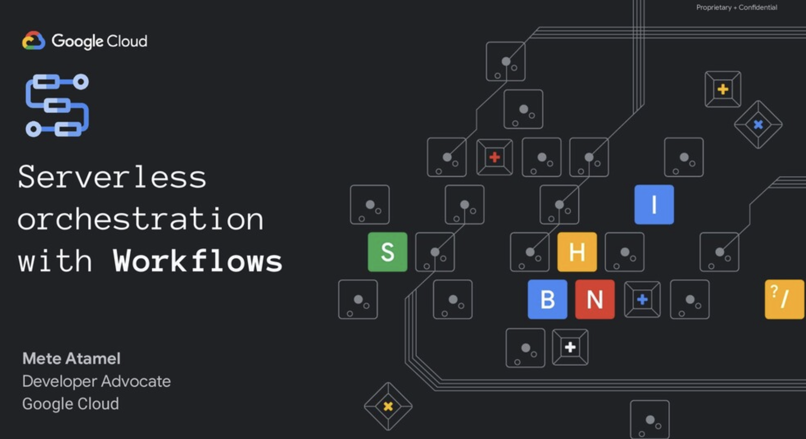

# Workflows Samples

[Workflows](https://cloud.google.com/workflows) allow you to orchestrate and
automate Google Cloud and HTTP-based API services with serverless workflows.

This repository contains a collection of samples for Workflows for various use
cases.

## Slides

There's a
[presentation](https://speakerdeck.com/meteatamel/serverless-orchestration-with-workflows)
that explains Workflows.

## Samples

* [Workflows syntax cheat sheet](syntax-cheat-sheet/workflow.yaml)
* [Create, start, stop VM using Compute Connector](connector-compute)
* [Write and read JSON files into GCS](gcs-read-write-json/)
* [Send an email with SendGrid from a workflow](send-email)
* [Data Loss Prevention workflow](gcs-dlp)
* [Service chaining](service-chaining)
* Eventarc and Workflows
  * [Eventarc (Cloud Storage) and Workflows](https://github.com/GoogleCloudPlatform/eventarc-samples/blob/main/eventarc-workflows-integration/eventarc-storage)
  * [Eventarc (AuditLog-Cloud Storage), Cloud Run and Workflows](https://github.com/GoogleCloudPlatform/eventarc-samples/blob/main/eventarc-workflows-integration/eventarc-auditlog-storage-cloudrun)
  * [Eventarc (Pub/Sub) and Workflows](https://github.com/GoogleCloudPlatform/eventarc-samples/blob/main/eventarc-workflows-integration/eventarc-pubsub)
  * [Eventarc (Pub/Sub), Cloud Run and Workflows](https://github.com/GoogleCloudPlatform/eventarc-samples/blob/main/eventarc-workflows-integration/eventarc-pubsub-cloudrun)
  * [Workflows and Eventarc (Pub/Sub)](workflows-eventarc-integration/workflows-pubsub)
  * [Image processing pipeline v2 - Eventarc (Cloud Storage) + Cloud Run + Workflows](https://github.com/GoogleCloudPlatform/eventarc-samples/tree/main/processing-pipelines/image-v2)
  * [Image processing pipeline v3 - Eventarc (Cloud Storage) + Workflows](https://github.com/GoogleCloudPlatform/eventarc-samples/tree/main/processing-pipelines/image-v3)
  * [Event payload storer](workflows-eventarc-integration/event-payload-storer)
* Terraform samples
  * [Basic Terraform](terraform/basic)
  * [Terraform with imported YAML](terraform/import-yaml)
  * [Terraform with multiple imported YAMLs](terraform/import-multiple-yamls)
* Machine Learning and iteration samples
  * [Batch Translation using Translation API connector](batch-translation)
  * [Reddit sentiment analysis using Language API connector and iteration](reddit-sentiment)
  * [Twitter sentiment analysis using Language API connector and iteration](twitter-sentiment)
  * [Twitter sentiment analysis using Language API connector and parallel iteration](twitter-sentiment-parallel)
* Callback samples
  * [Basic callback endpoint sample](callback-basic)
  * [Event callback sample](callback-event)
  * [Human validation of text translation via Workflows callback](callback-translation)
  * [Manager approval of expense reports thanks to Workflows callbacks](https://github.com/GoogleCloudPlatform/smart-expenses)
* [Retries and Saga Pattern in Workflows](retries-and-saga)
* [Long running containers with Workflows and Compute Engine](long-running-container)
* [Workflows state management with Firestore](state-management-firestore)
* Cloud Run and Workflows samples
  * [Execute a Cloud Run job using Workflows](cloud-run-jobs)
  * [Execute a Cloud Run job using Workflows and event payload from Cloud Storage](cloud-run-jobs-payload-gcs)
  * [Take screenshots of webpages with Cloud Run jobs, Workflows and Eventarc](screenshot-jobs)
* Batch and Workflows samples
  * [Batch - simple container](https://github.com/GoogleCloudPlatform/batch-samples/tree/main/busybox)
  * [Batch - prime number generator container](https://github.com/GoogleCloudPlatform/batch-samples/tree/main/primegen)
* [Running BigQuery jobs against Wikipedia dataset with Workflows parallel iteration](bigquery-parallel)
* Workflows lifecycle
  * [Git-driven development, testing & deployment](gitops)
  * [Multi-environment deployment](multi-env-deployment)
* Google Workspace and Workflows
  * [Triggering Workflows from Google Sheets](workspace-integration/sheets-to-workflows)
  * [Writing to Google Sheets from Workflows](workspace-integration/workflows-to-sheets)
  * [Workflows that pause and wait for human approvals from Google Sheets](workspace-integration/workflows-awaits-sheets-callback)
* Workflows executes commands (gcloud, kubectl)
  * [Workflows executes commands (gcloud, kubectl) - using Cloud Build API](workflows-executes-commands/using-cloudbuild-api/)
  * [Workflows executes commands (gcloud, kubectl) - using standard library](workflows-executes-commands/using-standard-library/)
* [Load data from Cloud Storage to BigQuery using Workflows](/workflows-bigquery-load/)
* [A workflow executes other workflows in parallel](./workflow-executes-other-workflows/)
* [Buffer workflow executions with a Cloud Tasks queue](./workflow-tasks-workflow/)
* [Deploy a Kubernetes application with Workflows](./workflows-kubernetes-engine/)
* Vertex AI and Workflows
  * [Call VertexAI PaLM 2 for Text (text-bison) from Workflows in parallel](./vertexai/country-histories/text-bison/)
  * [Call VertexAI Gemini Pro from Workflows in parallel](./vertexai/country-histories/gemini-pro/)
  * [Call VertexAI Gemini Pro Vision from Workflows to describe an image](./vertexai/describe-image/)
  * [Call VertexAI Gemini Pro from Workflows to summarize a long document in GCS using a map/reduce approach](./vertexai/parallel-summaries)
* [Export from Bigtable to Vertex Vector Search](./bigtable-ai/vertex-vector-search/workflows/)

-------

This is not an official Google product.
