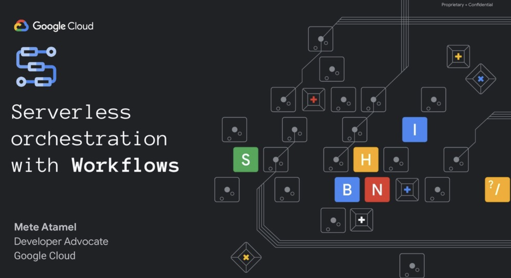

# Workflows Samples

[Workflows](https://cloud.google.com/workflows) allow you to orchestrate and
automate Google Cloud and HTTP-based API services with serverless workflows.

This repository contains a collection of samples for Workflows for various use
cases.

## Workflows Slides

There's a
[presentation](https://speakerdeck.com/meteatamel/serverless-orchestration-with-workflows)
that explains Workflows.

## Samples

* [Service chaining](docs/service-chaining.md)
* [Connector - Compute](docs/connector-compute.md)
* [Eventarc AuditLog-Cloud Storage and Workflows Integration](https://github.com/GoogleCloudPlatform/eventarc-samples/blob/main/docs/eventarc-auditlog-storage-workflows.md)
* [Eventarc Pub/Sub and Workflows Integration](https://github.com/GoogleCloudPlatform/eventarc-samples/blob/main/docs/eventarc-pubsub-workflows.md)
* [Workflows Terraform sample](docs/terraform.md)
* [Workflows Terraform with multiple external YAMLs](docs/terraform-multiple-yamls.md)

-------

This is not an official Google product.
