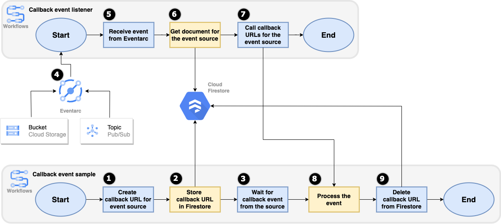
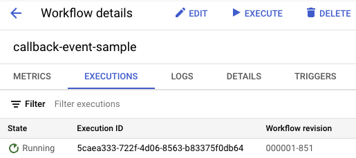
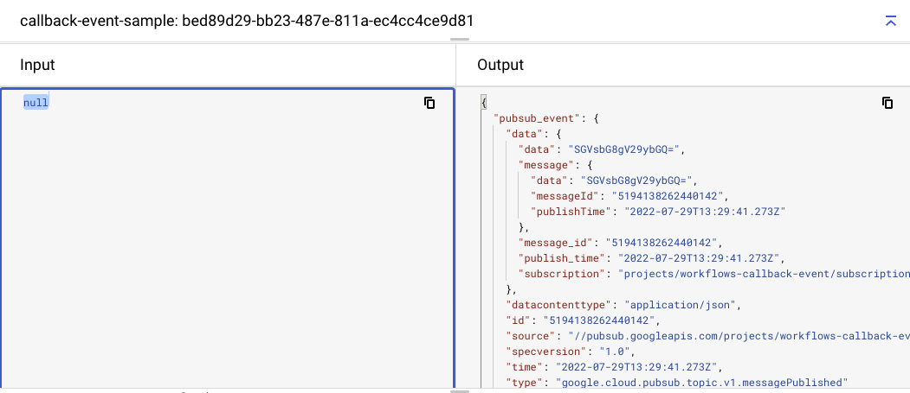

# Event callback sample

Workflows [callbacks](https://cloud.google.com/workflows/docs/creating-callback-endpoints)
allow workflow executions to wait for another service to make an HTTP request to the
callback endpoint; that request resumes the execution of the workflow.

This works for HTTP callbacks but wouldn't it be nice if Workflows waited for an
event callback as well such as a message to a Pub/Sub topic or a new file
creation in a Cloud Storage bucket?

In this sample, you'll see how to get Workflows listen for event callbacks from
Pub/Sub and Cloud Storage. The idea is as follows:



1. A `callback-event-sample` workflow creates a callback for an event source
   that it is interested in waiting events from.
1. It stores the callback for the event source in a document in Firestore.
1. It carries on with its workflow and at some point, starts waiting for an
   event.
1. In the meantime, `callback-event-listener` is waiting for events from a
   Pub/Sub topic and a Cloud Storage bucket with Eventarc.
1. At some point, Eventarc receives an event and passes on the event listener.
1. Finds the document for the event source in Firestore.
1. Calls back all the callback URLs registered with that event source.
1. `callback-event-sample` workflow receives the event and stops waiting.
1. It deletes the callback url from Firestore and continues with its workflow.

## Before you begin

You can use an existing project or create a new project:

```sh
PROJECT_ID=your-project-id
gcloud projects create $PROJECT_ID
```

Make sure your project id is set in `gcloud`:

```sh
gcloud config set project $PROJECT_ID
```

Run [setup.sh](setup.sh) to:

1. Enable required services and initialize a Firestore database.
1. Create a Pub/Sub topic and a Cloud Storage bucket to listen events from.
1. Deploy a `callback-event-listener` workflow.
1. Create Eventarc triggers to listen for Pub/Sub and Cloud Storage events and
   forward to the `callback-event-listener` workflow.
1. Deploy a `callback-event sample` workflow.

## Callback event listener

Callback event listener listens for events from Eventarc, checks if Firestore
has registered callbacks for the event source and if so, calls those callbacks
with the event. You can see
[callback-event-listener.yaml](callback-event-listener.yaml) for details.

## Callback event sample

You can check [callback-event-sample.yaml](callback-event-sample.yaml) for a
sample workflow to wait for an event from a Pub/Sub topic and a Cloud Storage
bucket by creating a callback, storing it to Firestore, waiting for the callback
from the `callback-event-listener` and deleting the callback from Firestore.

## Test

To test the event callbacks, first execute the sample workflow:

```sh
gcloud workflows run callback-event-sample
```

The workflow should just wait and you can also confirm it on Google Cloud
Console:



To test Pub/Sub callbacks, send a Pub/Sub message:

```sh
TOPIC=topic-callback
gcloud pubsub topics publish $TOPIC --message="Hello World"
```

You should see that the workflow started and stopped waiting for the event. It
also receives the Pub/Sub message in its callback:

```sh
Started waiting for an event from source topic-callback
Stopped waiting for an event from source topic-callback
```

To test Cloud Storage events, upload a new file to Cloud Storage:

```sh
BUCKET=$PROJECT_ID-bucket-callback
echo "Hello World" > random.txt
gsutil cp random.txt gs://$BUCKET/random.txt
```

You should see that the workflow started and stopped waiting for the event. It
also receives the Cloud Storage event in its callback:

```sh
Started waiting for an event from source $PROJECT_ID-bucket-callback
Stopped waiting for an event from source $PROJECT_ID-bucket-callback
```

At this point, the workflow should stop executing and you should also see the
received Pub/Sub and Cloud Storage events in the output:


