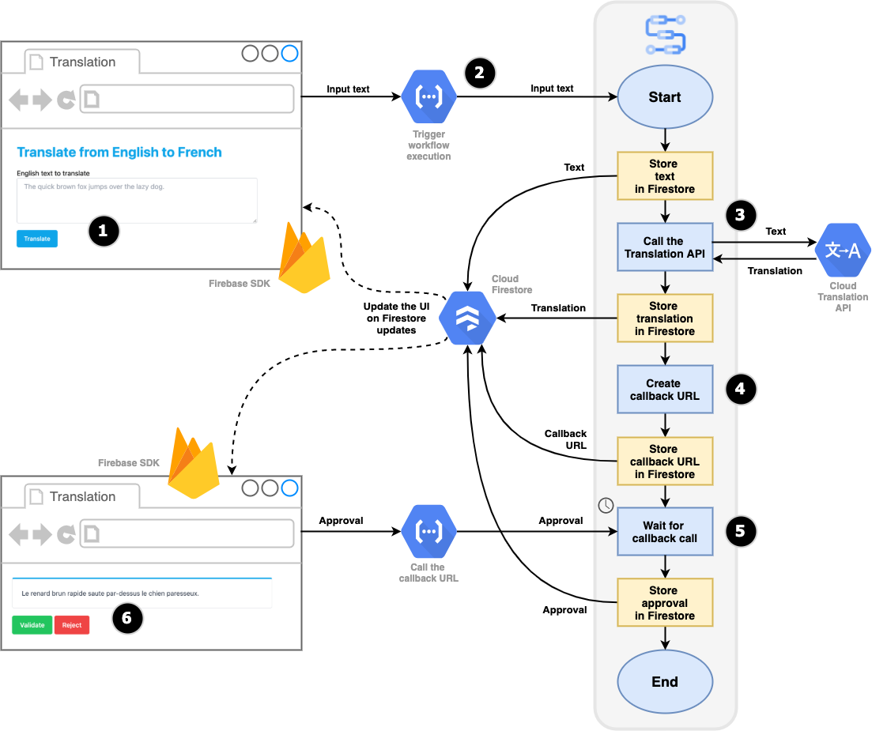

# Human validation of text translation via Webhooks callback endpoints

In this example, you will take advantage of the **callback** feature of Workflows:
by creating an HTTP callback, and waiting for some external user or process 
to call that callback endpoint.
This allows workflow executions to be paused, and then be resumed once the callback endpoint is called.

The use case in this sample is **human validation of automated translation**.
On a web page, a user can enter some text in English, and request its translation in French.
A workflow executes, calls the [Translation API](https://cloud.google.com/translate),
waits for the user to either validate or reject the translation, thanks to a callback.
And the workflow execution finishes with the outcome of this validation.

## Technical overview

This demo consists of:
* a Cloud Firestore database to store the text, the translation, the callback endpoint, the approval status, as those details are available
* the web page is using the Firebase SDK to get updates in realtime when data stored in Firestore is updated
* two Cloud Functions called from the web page:
    * a first function to trigger the workflow execution, passing the input text to translate
    * a second function to call the callback endpoint, passing the approval status
* and a workflow is orchestrating the whole process

## Architecture diagram



1. First, the user visits the translation web page.
The web page can be hosted anywhere, in a cloud storage bucket, on Firebase hosting, or App Engine.
The user then fills a textarea with the text they want to translate, and click on the *translate* button.
2. Clicking on the button will call a Cloud Function, that will launch an execution of the workflow. The text to translate is passed as a parameter of the function, and as a parameter of the workflow too.
3. The text is saved in Cloud Firestore, and the Translation API is called with the input text, and will return the translation, which will be stored in Firestore as well. The translation appears in the web page.
4. A step in the workflow creates a callback endpoint (also saved in Firestore), so that it can be called to validate or reject the automatic translation. When the callback endpoint is saved in Firestore, the web page displays validation and rejection buttons.
5. The workflow now explicitly awaits the callback endpoint to be called. This pauses the workflow execution.
6. The user decides to either validate or reject the translation. When one of the two buttons is clicked, a Cloud Function is called, with the approval status as parameter, which will in turn call the callback endpoint created by the workflow, also passing the approval status. The workflow resumes its execution, and saves the approval in Firestore. And this is the end of our workflow.

## Creating a workflow callback and awaiting

In order to create a callback, here's the definition of the step in the workflow:

```yaml
- create_callback:
    call: events.create_callback_endpoint
    args:
        http_callback_method: "POST"
    result: callback_details
```

You call the `events.create_callback_endpoint` built-in function.
As argument, you pass the HTTP method you want the caller to use to call your callback endpoint. The `callback_details` result is a dictionary that contains the URL of the callback. At this point, the callback is ready to receive incoming requests.

```yaml
- await_callback:
    call: events.await_callback
    args:
        callback: ${callback_details}
        timeout: 3600
    result: callback_request
```

To explicitly pause the workflow, to await the incoming request on the callback endpoint, you have to call the `events.await_callback` built-in function, passing the callback details as argument, as well as the duration in seconds that you want to wait for the callback to arrive.

## Triggering the execution of a workflow

The first fuction is responsible for launching the execution of the workflow.

```javascript
// require the Workflows NPM module
const {ExecutionsClient} = require('@google-cloud/workflows');
const client = new ExecutionsClient();

// create the workflow execution
const execResponse = await client.createExecution({
    parent: client.workflowPath(PROJECT_ID, CLOUD_REGION, WORKFLOW_NAME),
    execution: {
        argument: JSON.stringify({text})
    }
});

// retrive the execution details, including the execution ID
const execName = execResponse[0].name;
};
```

The `@google-cloud/workflows` NPM module, and its `ExecutionClient` class will create executions of the workflows, via its `createExecution()` method. 

A workflow is identified via its project ID, the cloud region within which it's deployed, and the name of the workflow.

You can pass an argument to the workflow execution, in the form of a JSON object encoded as a string.

The result of this execution creation will return an object that identifies a workflow execution, including its execution ID.

## Calling a workflow callback endpoint

The second cloud function is responsible for calling the callback endpoint. This snippets below show the call made with the `node-fetch` NPM module. But it is also using the `google-auth-library` to make an authenticated call, thanks to an access token.

```javascript
const fetch = require('node-fetch');

// fetch an access token
const {GoogleAuth} = require('google-auth-library');
const auth = new GoogleAuth();
const token = await auth.getAccessToken();

// call the callback endpoint URL
const resp = await fetch(url, {
    method: 'POST',
    headers: {
        'accept': 'application/json',
        'content-type': 'application/json',
        'authorization': `Bearer ${token}`
    },
    body: JSON.stringify({ approved })
});

// check the result to ensure that the call succeeded
const result = await resp.json();
```

## Project setup

The following APIs need to be enabled:

```sh
gcloud services enable \
    appengine.googleapis.com \
    cloudbuild.googleapis.com \
    cloudfunctions.googleapis.com \
    firestore.googleapis.com \
    workflows.googleapis.com \
    translate.googleapis.com
```

> **Note —** Some of the commands below needs adaptation depending on which regions you want to develop the functions, the database, or the workflow definitoin.

### Preparing the Cloud Firestore database

```sh
export REGION=europe-west2

gcloud app create --region=${REGION}
gcloud firestore databases create --region=${REGION}
```

### Deploying the two cloud functions

```sh
gcloud functions deploy invokeTranslationWorkflow \
  --region=${REGION} \
  --source=./functions/invokeTranslationWorkflow \
  --runtime nodejs14 \
  --entry-point=invokeTranslationWorkflow \
  --set-env-vars PROJECT_ID=${GOOGLE_CLOUD_PROJECT},CLOUD_REGION=${REGION},WORKFLOW_NAME=translation_validation \
  --trigger-http \
  --allow-unauthenticated

gcloud functions deploy translationCallbackCall \
  --region=${REGION} \
  --source=./functions/translationCallbackCall \
  --runtime nodejs14 \
  --entry-point=translationCallbackCall \
  --trigger-http \
  --allow-unauthenticated
```

### Hosting the web page

The HTML page, the JavaScript script, the CSS stylesheet, can be hosted anywhere where they can be freely accessible. They can as well be served locally on your own machine for testing purpose. 

When developing this demo, I deployed the static assets on Firebase Hosting, and after installing the Firebase SDK on my machine, was able to run the files locally with:

```sh
firebase serve
```

> **Note —** The `script.js` file should be updated with the right URL pointing at the two functions used to create the workflow execution, and call the callback. 
Search for the `UPDATE_ME` placeholder value, and update both occurrences.

> **Note —** The `index.html` file contains the Firebase configuration. If you're deploying on Firebase Hosting, be sure to update the `XXXX` placeholder values withe the right configuration from Firebase.

### Deploying the workflow definition

```sh
export WORKFLOWS_REGION=europe-west2

gcloud workflows deploy translation_validation \
    --source=translation-validation.yaml \
    --region=${WORKFLOWS_REGION}
```
