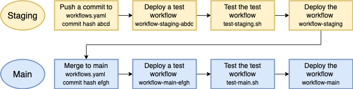
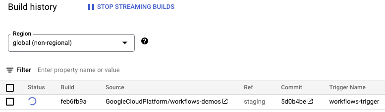
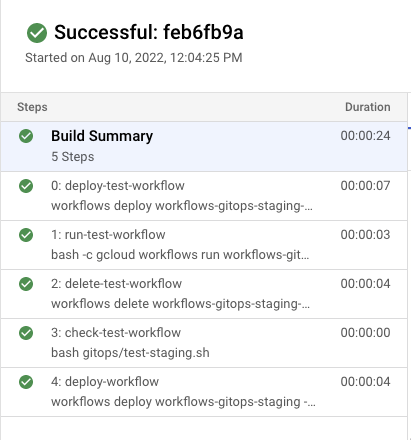
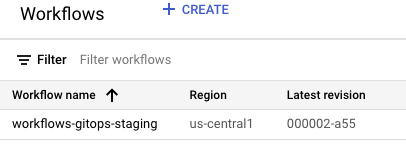
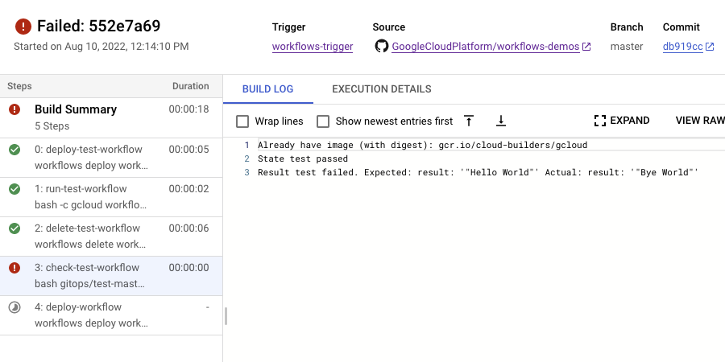
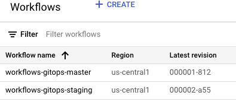

# Git-driven development, testing & deployment

In this sample, we show you how to set up a simple Git-driven development,
testing & deployment pipeline for Workflows using Cloud Build.

## Architecture

### Overview

You have a `staging` branch where you make changes to a workflow. This triggers
Cloud Build to deploy a test staging workflow, run some staging tests against it and
if all tests pass, deploy a staging workflow. After more manual testing of the
staging workflow, you merge changes from `staging` branch to `main` branch. This
triggers the same Cloud Build to deploy a test production workflow, run more
production tests and if all tests pass, deploy the production workflow.



### Details

1. You have a workflow defined in [workflow.yaml](workflow.yaml) that simply
   returns `Hello World`.
1. You change the workflow and push to the `staging` branch.
1. This triggers a Cloud Build trigger defined in
   [cloudbuild.yaml](cloudbuild.yaml) that deploys a test staging workflow, runs it,
   captures its output, deletes the test workflow and then runs tests defined in
   [test-staging.sh](test-staging.sh) that simply checks for the state of the
   workflow. If the test passes, it deploys the staging workflow for further
   manual testing.
1. After more manual testing of the staging workflow, you merge changes from
   `staging` branch to `main` branch.
1. This triggers the same Cloud Build trigger against the `main` branch and runs
   tests defined in [test-main.sh](test-master.sh) that checks the state and
   also the output of the workflow. If all tests pass, it deploys the production
   workflow.

## Before you begin

You can use an existing project or create a new project:

```sh
PROJECT_ID=your-project-id
gcloud projects create $PROJECT_ID
```

Make sure your project id is set in `gcloud`:

```sh
gcloud config set project $PROJECT_ID
```

Run [setup.sh](setup.sh) to enable required services and grant necessary roles.

## Connect repository to Cloud Build

You need to connect
[workflows-demo](https://github.com/GoogleCloudPlatform/workflows-demos)
repository to Cloud Build before creating triggers. Follow the instructions
[here](https://cloud.google.com/build/docs/automating-builds/github/connect-repo-github#connecting_a_github_repository).

## Create a Cloud Build trigger

You can now create a Cloud Build trigger to watch for commits to `main` and
`staging` branches. General instructions are
[here](https://cloud.google.com/build/docs/automating-builds/create-manage-triggers).

Go to `Create Trigger` section of Cloud Build in the console and create a
trigger with the following properties:

* Name: `workflows-trigger`
* Event: Push to a branch
* Repository: `GoogleCloudPlatform/workflows-demos`
* Branch: `^master$|^staging$`
* Included files filter: `gitops/workflow.yaml`
* Configuration type: Cloud build configuration file
* Cloud build configuration file location: `gitops/cloudbuild.yaml`
* Add a Substition variable with key/value: `_WORKFLOW_NAME` and `workflows-gitops`

## Test staging workflow

To test the build pipeline, first switch to the `staging` branch:

```sh
git checkout staging
```

Change `Hello World` in [workflow.yaml](workflow.yaml) to `Bye World`:

```sh
     - init:
         assign:
-          - message: "Hello World"
+          - message: "Bye World"
```

Commit and push the change to `staging` branch:

```sh
git add workflow.yaml
git commit -m "Update workflow.yaml in staging"
git push
```

You should see the trigger running:



After a few seconds, the build is successful too with its all stages:



And a staging workflow has been deployed:



## Test production workflow

Once you're ready to deploy the staging workflow to production, you simply merge
the `staging` branch to `main` branch.

```sh
git checkout main
git merge staging
git push
```

However, the build fails:



This is because tests for production workflow in
[test-main.sh](test-master.sh) is expecting to see `Hello World` as output of
the workflow.

You need to go back to the `staging` branch, change `Bye World` in
[workflow.yaml](workflow.yaml) back to `Hello World`:

```sh
     - init:
         assign:
-          - message: "Bye World"
+          - message: "Hello World"
```

Check in changes to `staging`, see the build succeed, merge to `main` and
finally, you should also see the build to succeed and a production workflow has
also been deployed alongside staging:


