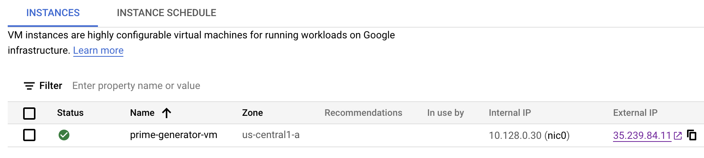

# Long running containers with Workflows and Compute Engine

Sometimes, you need to execute a long-running task for hours or even days.
Both Cloud Functions and Cloud Run have time limitations on how long a
function/container can run. This rules out the idea of executing long-running
tasks serverlessly. Or does it?

In this tutorial, you will see how to automate running of a long-running
container, almost serverlessly, using Workflows and Compute Engine.

## Idea in a nutshell

The idea is to as follows:

1. Containerize the long-running task, so it can run anywhere.
2. Plan to run the container on a Compute Engine VM with no time limitations.
3. Automate the creation of the VM, running of the container on the VM, and deletion of
   the VM with Workflows.

With this approach, you simply execute the workflow to run the long-running
container on the VM and get the result back, while the underlying VM lifecycle is
abstracted away.

Let's see how we can set this up with an example.

## Prime number generator

For the long running container, we will use a prime number generator. The source
is in [PrimeGenService](PrimeGenService) folder.

It also has a simple web API in
[PrimeGenController.cs](PrimeGenService/Controllers/PrimeGenController.cs):

* `/start`: Starts calculating the largest prime.
* `/stop`: Stops calculating the largest prime.
* `/`: Returns the calculated largest prime so far.

There's a [Dockerfile](Dockerfile) to run it as a container.

Let's build and push the container that we'll need later:

```sh
gcloud builds submit --tag gcr.io/$PROJECT_ID/primegen-service
```

The container also needs HTTP on port 80, let's make it there's a firewall rule
open for it:

```sh
gcloud compute firewall-rules create default-allow-http --allow tcp:80
```

## Build the workflow

Let's build the workflow. The full source is in
[prime-generator.yaml](prime-generator.yaml).

First, read in some arguments such as the name of the VM to create and the
number of seconds to run the VM:

```yaml
main:
  params: [args]
  steps:
  - init:
      assign:
      - projectId: ${sys.get_env("GOOGLE_CLOUD_PROJECT_ID")}
      - projectNumber: ${sys.get_env("GOOGLE_CLOUD_PROJECT_NUMBER")}
      - zone: "us-central1-a"
      - machineType: "c2-standard-4"
      - instanceName: ${args.instanceName}
      - workSeconds: ${args.workSeconds}
```

Next, create a container-optimized VM with an external IP, right
scopes to be able to run the container and also specify the actual container to
run:

```yaml
  - create_and_start_vm:
      call: googleapis.compute.v1.instances.insert
      args:
        project: ${projectId}
        zone: ${zone}
        body:
          tags:
            items:
            - http-server
          name: ${instanceName}
          machineType: ${"zones/" + zone + "/machineTypes/" + machineType}
          disks:
          - initializeParams:
              sourceImage: "projects/cos-cloud/global/images/cos-stable-93-16623-39-40"
            boot: true
            autoDelete: true
          # Needed to make sure the VM has an external IP
          networkInterfaces:
          - accessConfigs:
            - name: "External NAT"
              networkTier: "PREMIUM"
          # The container to run
          metadata:
              items:
              - key: "gce-container-declaration"
                value: '${"spec:\n  containers:\n  - name: primegen-service\n    image: gcr.io/" + projectId + "/primegen-service\n    stdin: false\n    tty: false\n  restartPolicy: Always\n"}'
          # Needed to be able to pull down and run the container
          serviceAccounts:
          - email: ${projectNumber + "-compute@developer.gserviceaccount.com"}
            scopes:
            - https://www.googleapis.com/auth/devstorage.read_only
            - https://www.googleapis.com/auth/logging.write
            - https://www.googleapis.com/auth/monitoring.write
            - https://www.googleapis.com/auth/servicecontrol
            - https://www.googleapis.com/auth/service.management.readonly
            - https://www.googleapis.com/auth/trace.append
```

Once the VM is created and running, get the external IP of the service and
build the start/stop/get urls for the Web API:

```yaml
  - get_instance:
      call: googleapis.compute.v1.instances.get
      args:
        instance: ${instanceName}
        project: ${projectId}
        zone: ${zone}
      result: instance
  - extract_external_ip_and_construct_urls:
      assign:
          - external_ip: ${instance.networkInterfaces[0].accessConfigs[0].natIP}
          - base_url: ${"http://" + external_ip + "/"}
          - start_url: ${base_url + "start"}
          - stop_url: ${base_url + "stop"}
```

Then, we start the prime number generation and sleep for the specified number of seconds:

```yaml
  - start_work:
      call: http.get
      args:
          url: ${start_url}
  - wait_for_work:
      call: sys.sleep
      args:
          seconds: ${int(workSeconds)}
```

Once the sleep is done, we stop the prime number generation and get the largest
calculated prime:

```yaml
  - stop_work:
      call: http.get
      args:
          url: ${stop_url}
  - get_result:
      call: http.get
      args:
          url: ${base_url}
      result: final_result
```

Finally, we delete the VM and return the result:

```yaml
  - delete_vm:
      call: googleapis.compute.v1.instances.delete
      args:
          instance: ${instanceName}
          project: ${projectId}
          zone: ${zone}
  - return_result:
      return: ${final_result.body}
```

## Deploy and execute the workflow

Deploy the workflow:

```sh
WORKFLOW_NAME=prime-generator
gcloud workflows deploy $WORKFLOW_NAME --source=prime-generator.yaml
```

Execute the workflow for 1 hour:

```sh
gcloud workflows run $WORKFLOW_NAME --data='{"instanceName":"prime-generator-vm", "workSeconds":"3600"}'
```

This creates a VM and starts calculating prime number in the container for 1
hour:



Once times up, you should get the calculated prime back (and the VM is already deleted):

```sh
result: '"340297"'
startTime: '2022-01-24T14:02:34.857760501Z'
state: SUCCEEDED
```
