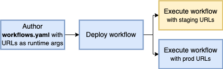
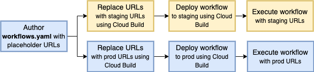
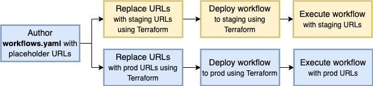

# Multi-environment deployment

In this sample, we show you how to use the same worklow in different
environments such as `staging` and `prod`.

As a concrete example, instead of hardcoding the URLs called from the workflow,
we show you how to replace the URLs with `staging` and `prod` URLs depending on
where the workflow is being deployed.

We'll explore 3 different ways of replacing URLs.

## Option 1: Use URLs as runtime arguments



In the first option, you define URLs as runtime arguments and use them whenever
you need to call a service:

```yaml
main:
  params: [args]
  steps:
    - init:
        assign:
          - url1: ${args.urls.url1}
          - url2: ${args.urls.url2}
```

You can deploy [workflow1.yaml](workflow1.yaml) as an example:

```sh
gcloud workflows deploy multi-env1 --source workflow1.yaml
```

Run the workflow in `staging` environment with `staging` URLs:

```sh
gcloud workflows run multi-env1 --data='{"urls":{"url1": "https://us-central1-projectid.cloudfunctions.net/func1-staging", "url2": "https://us-central1-projectid.cloudfunctions.net/func2-staging"}}'
```

Run the workflow in `prod` environment with `prod` URLs:

```sh
gcloud workflows run multi-env1 --data='{"urls":{"url1": "https://us-central1-projectid.cloudfunctions.net/func1-prod", "url2": "https://us-central1-projectid.cloudfunctions.net/func2-prod"}}'
```

## Option 2: Use Cloud Build to deploy multiple versions



In the second option, you can use Cloud Build to deploy multiple versions of the
workflow with the appropriate `staging` and `prod` URLs replaced at
deployment time.

Run [setup.sh](setup.sh) to enable required services and grant necessary roles.

Define [workflow2.yaml](workflow2.yaml) that has placeholder values for URLs:

```yaml
main:
  steps:
    - init:
        assign:
          - url1: REPLACE_url1
          - url2: REPLACE_url2
```

Define [cloubuild.yaml](cloudbuild.yaml) that has a step to replace placeholder
URLs and a deployment step:

```yaml
steps:
- id: 'replace-urls'
  name: 'gcr.io/cloud-builders/gcloud'
  entrypoint: bash
  args:
    - -c
    - |
      sed -i -e "s~REPLACE_url1~$_URL1~" workflow2.yaml
      sed -i -e "s~REPLACE_url2~$_URL2~" workflow2.yaml
- id: 'deploy-workflow'
  name: 'gcr.io/cloud-builders/gcloud'
  args: ['workflows', 'deploy', 'multi-env2-$_ENV', '--source', 'workflow2.yaml']
```

Deploy the workflow in the `staging` environment with `staging` URLs:

```sh
gcloud builds submit --config cloudbuild.yaml --substitutions=_ENV=staging,_URL1="https://us-central1-projectid.cloudfunctions.net/func1-staging",_URL2="https://us-central1-projectid.cloudfunctions.net/func2-staging"
```

Deploy the workflow in the `prod` environment with `prod` URLs:

```sh
gcloud builds submit --config cloudbuild.yaml --substitutions=_ENV=prod,_URL1="https://us-central1-projectid.cloudfunctions.net/func1-prod",_URL2="https://us-central1-projectid.cloudfunctions.net/func2-prod"
```

Now, we have 2 workflows ready to run in `staging` and `prod` environments:

```sh
gcloud workflows run multi-env2-staging
gcloud workflows run multi-env2-prod
```

## Option 3: Use Terraform to deploy multiple versions



In the third option, you can use Terraform to deploy multiple versions of the
workflow with the appropriate `staging` and `prod` URLs replaced at
deployment time.

Define [workflow3.yaml](workflow3.yaml) that has placeholder values for URLs:

```yaml
main:
  steps:
    - init:
        assign:
          - url1: ${url1}
          - url2: ${url2}
```

Define [main.tf](main.tf) that creates `staging` and `prod` workflows:

```terraform
variable "project_id" {
  type = string
}

variable "url1" {
  type = string
}

variable "url2" {
  type = string
}

locals {
  env = ["staging", "prod"]
}

# Define and deploy staging and prod workflows
resource "google_workflows_workflow" "multi-env3-workflows" {
  for_each = toset(local.env)

  name            = "multi-env3-${each.key}"
  project         = var.project_id
  region          = "us-central1"
  source_contents = templatefile("${path.module}/workflow3.yaml", { url1 : "${var.url1}-${each.key}", url2 : "${var.url2}-${each.key}" })
}
```

Initialize Terraform:

```sh
terraform init
```

See planned changes:

```sh
terraform plan -var="project_id=YOUR-PROJECT-ID" -var="url1=https://us-central1-projectid.cloudfunctions.net/func1" -var="url2=https://us-central1-projectid.cloudfunctions.net/func2"
```

Deploy the workflow in the `staging` environment with `staging` URLs and `prod`
environment with `prod` URLs:

```sh
terraform apply -var="project_id=YOUR-PROJECT-ID" -var="url1=https://us-central1-projectid.cloudfunctions.net/func1" -var="url2=https://us-central1-projectid.cloudfunctions.net/func2"
```

Now, we have 2 workflows ready to run in `staging` and `prod` environments:

```sh
gcloud workflows run multi-env3-staging
gcloud workflows run multi-env3-prod
```

## Pros and cons

**Option1** is a simpler setup (a single workflow deployment) but a more complicated
execution, as you need to pass in URLs in every execution. If you have a lot of
URLs, executions can get too verbose with all the runtime arguments for URLs.
Also, you can't tell which URLs your workflow will call until you actually execute the
workflow.

**Option2** is a more complicated setup with multiple workflow deployments with
Cloud Build. However, the workflow contains the URLs being called and that
results in a simpler execution.

**Option3** is pretty much the same as Option 2 but for Terraform users.
