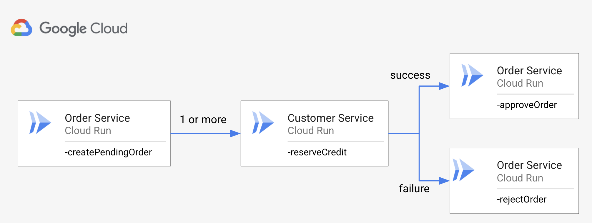

# Retries and Saga Pattern in Workflows

In this tutorial, you will see how to apply retries and the saga pattern in
Workflows for more resilient service orchestration.

## Background

**How to implement transactions that span services?** This is the main problem the
saga pattern tries to solve. The following [blog
series](https://microservices.io/patterns/data/saga.html) by [Chris
Richardson](https://twitter.com/crichardson) explains the issue and the saga
pattern in much more detail.

In this tutorial, we will reuse the `OrderService` and `CustomerService` mentioned
in Chris' blog and apply the retries and saga pattern in the context of
Workflows.

Imagine, you're building an e-commerce app and you need to handle orders. You
need to receive orders and make sure customers have enough credit to process the
order.

### Naive implementation

In a naive implementation, you might have 2 services,
`OrderService` to receive orders and `CustomerService` to manage customer's credit:


This works if services never fail but we know this is not always true.

### Apply retries

If `CustomerService` becomes unavailable once in a while (HTTP 503), the naive
implementation stops working. One solution is to retry calls to go around the
transient failure:


This works for transient failures but what if the failure is not transient? What
if the failure is due to an unrecoverable error like the customer not actually
having credit?

### Apply saga

When the failure in `CustomerService` is permanent, you need to reject the order:



This is the saga pattern where a failed call down the chain triggers a
compensation call up the chain. Let's see how we can implement this in Google Cloud.

## Deploy microservices

Let's deploy `OrderService` and `CustomerService` as Cloud Run services.

### OrderService

The source of the `OrderService` is in [OrderService](OrderService) folder. It's
a web app to create, delete, approve and reject orders. You can see the
[OrderController](OrderService/Controllers/OrderController.cs) for the Web API.

Build the container:

```sh
PROJECT_ID=$(gcloud config get-value project)
SERVICE_NAME=order-service

gcloud builds submit --tag gcr.io/$PROJECT_ID/$SERVICE_NAME
```

Deploy to Cloud Run:

```sh
REGION=us-central1

gcloud run deploy $SERVICE_NAME \
  --image gcr.io/$PROJECT_ID/$SERVICE_NAME \
  --allow-unauthenticated \
  --region $REGION
```

### CustomerService

The source of the `CustomerService` is in [CustomerService](CustomerService) folder. It's
a web app to reserve credit for a customer. You can see the
[CustomerController](CustomerService/Controllers/CustomerController.cs) for the Web
API. It has two main APIs that will be useful to test retries and saga pattern later:

* `/always-works`: Always reserves credit (HTTP 200).
* `/sometimes-works`: Sometimes reserves credit (HTTP 200), sometimes returns a
  recoverable error (HTTP 503) and sometimes returns a non-recoverable error
  (HTTP 500).

Build the container:

```sh
PROJECT_ID=$(gcloud config get-value project)
SERVICE_NAME=customer-service

gcloud builds submit --tag gcr.io/$PROJECT_ID/$SERVICE_NAME
```

Deploy to Cloud Run:

```sh
REGION=us-central1

gcloud run deploy $SERVICE_NAME \
  --image gcr.io/$PROJECT_ID/$SERVICE_NAME \
  --allow-unauthenticated \
  --region $REGION
```

## Workflows

Now, let's deploy some workflows with increasing resiliency using retries and
the saga pattern.

### Naive implementation

In the naive implementation, we (wrongly) assume that all services just work.
You can see the full workflow [ordering-v1.yaml](ordering-v1.yaml).

The workflow uses the `/always-works` endpoint:

```yaml
    - init:
        assign:
          # Replace with your service URLs
          - url_order_service: https://order-service-wvdg6hhtla-uc.a.run.app
          - url_customer_service: https://customer-service-wvdg6hhtla-uc.a.run.app/always-works
```

There's no error handling in `reserve_credit` and the order is approved no
matter what in `approve_pending_order` step:

```yaml
    - reserve_credit:
        call: http.post
        args:
            url: ${url_customer_service}
            body:
                customerId: ${pending_order.body.customerId}
                amount: 10.50
        result: the_credit
    - approve_pending_order:
        call: http.put
        args:
            url: ${url_order_service+"/approve/"+pending_order.body.id}
        result: approved_order
```

This works because `CustomerService` always works but it's not realistic!

You can deploy and execute the workflow:

```sh
WORKFLOW_NAME=ordering-v1
gcloud workflows deploy $WORKFLOW_NAME --source=ordering-v1.yaml
gcloud workflows execute $WORKFLOW_NAME
```

It will always succeed.

### Apply retries

In the next phase of the workflow, let's change the customer endpoint to
`/sometimes-works` to simulate failures:

```yaml
    - init:
        assign:
          # Replace with your service URLs
          - url_order_service: https://order-service-wvdg6hhtla-uc.a.run.app
          - url_customer_service: https://customer-service-wvdg6hhtla-uc.a.run.app/sometimes-works
```

The workflow will start failing because `CustomerService` is throwing
recoverable (HTTP 503) and non-recoverable (HTTP 500) errors now.

The recoverable error can be handled by wrapping the HTTP call with a `try` and
applying a `retry` policy:

```yaml
    - reserve_credit:
        try:
            call: http.post
            args:
                url: ${url_customer_service}
                body:
                    customerId: ${pending_order.body.customerId}
                    amount: 10.50
            result: the_credit
        # Retries with max_retries of 5 on HTTP 503 (Service unavailable) (along
        # with HTTP 429, 502, 503, 504) to recover from transient error.
        retry: ${http.default_retry}
```

In this case, we're using the simple HTTP default try policy but you can fully
customize the retry policy.

With this change, the `reserve_credit` step will improve. It will only fail when
there's a non-recoverable failure.

You can see the full workflow [ordering-v2.yaml](ordering-v2.yaml).

### Apply saga

To make the workflow even more resilient, we need to also handle the
non-recoverable errors.

In `reserve_credit` step, we now check for non-recoverable errors and route them
to the `reject_pending_order` step:

```yaml
    - reserve_credit:
        try:
            call: http.post
            args:
                url: ${url_customer_service}
                body:
                    customerId: ${pending_order.body.customerId}
                    amount: 10.50
            result: the_credit
        # Retries with max_retries of 5 on HTTP 503 (Service unavailable) (along
        # with HTTP 429, 502, 503, 504) to recover from transient error.
        retry: ${http.default_retry}
        except:
            as: e
            steps:
                - check_nonrecoverable_error:
                    switch:
                    # HTTP 500 (Internal Server Error) indicates the credit
                    # cannot be reserved. Apply the compensation step to reject
                    # the order.
                    - condition: ${e.code == 500}
                      next: reject_pending_order
                - raiseError:
                    raise: ${e}
```

The `reject_pending_order` step does the compensation call to the
`OrderService`:

```yaml
    - reject_pending_order:
        call: http.put
        args:
            url: ${url_order_service+"/reject/"+pending_order.body.id}
        result: order
```

With this change, depending on what happens in `reserve_credit`, the order is
either accepted or rejected and the transient failures are handled by the retry
policy. Much better!

You can see the full workflow [ordering-v3.yaml](ordering-v3.yaml).

---

In this tutorial, we showed you how to apply retries and the saga pattern in a
simple workflow involving 2 services. In multi-service and multi-status code
scenarios, it gets more complicated but the basic idea is the same: apply retries
for recoverable errors and apply (possibly nested) compensation steps for
non-recoverable errors.
