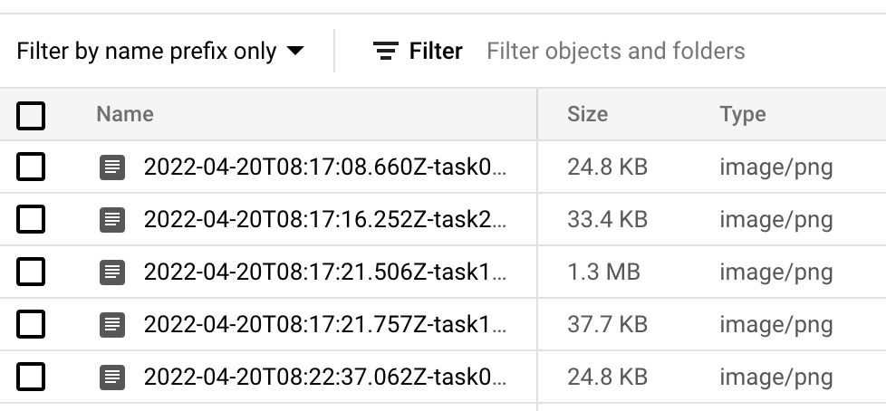

# Take screenshots of webpages with Cloud Run jobs, Workflows and Eventarc

In this tutorial, you will see how to use Cloud Run jobs to take screenshots of
webpages, Workflows to manage the lifecycle of Cloud Run jobs and Eventarc to
respond to job requests saved in a Cloud Storage storage.

## Architecture overview


1. User uploads a job (a txt file with a list of urls) to a Cloud Storage bucket.
1. This triggers a Cloud Storage event via Eventarc to Workflows.
1. Workflows picks the event and parses the urls from the file.
1. Workflows creates a new job with a new task for each url.
1. Workflows runs and waits for all the tasks of the job to complete.
1. If job is successful, Workflows deletes the txt file and the job. If
   unsuccessful, job is not deleted to allow debugging of what happened.

## Setup

First, enable required services:

```sh
gcloud services enable \
  artifactregistry.googleapis.com \
  cloudbuild.googleapis.com \
  eventarc.googleapis.com \
  run.googleapis.com \
  workflows.googleapis.com \
  workflowexecutions.googleapis.com
```

Set your project ID and the region you want to deploy the Cloud Run job to. Save
them as `PROJECT_ID` and `REGION` variables. You can pick a region from one of the
Cloud Run locations.

```sh
PROJECT_ID=[YOUR-PROJECT-ID]
REGION=[YOUR-REGION]
gcloud config set core/project $PROJECT_ID
gcloud config set run/region $REGION
```

## Get the code

Clone the application code from [source code repo](https://github.com/GoogleCloudPlatform/jobs-demos.git):

```sh
git clone https://github.com/GoogleCloudPlatform/jobs-demos.git
```

Go to the directory containing the application:

```sh
cd jobs-demos/screenshot
```

It's a Node.js application to take screenshots of web pages and store them to
Cloud Storage. Feel free to explore the code on your own.

## Build and publish the container image

Create a new Artifact Registry repository to store container images:

```sh
gcloud artifacts repositories create containers --repository-format=docker --location=$REGION
```

Build and publish the container image:

```sh
gcloud builds submit -t $REGION-docker.pkg.dev/$PROJECT_ID/containers/screenshot:v1
```

After a couple of minutes, you should see the container image built and hosted on Artifact Registry.

## Create a bucket for job requests

Create a bucket for users to upload job requests:

```sh
BUCKET=screenshot-jobs-$PROJECT_ID
gsutil mb gs://$BUCKET
```

## Setup service accounts

Create a service account that you will use to run the job.

```sh
gcloud iam service-accounts create screenshot-sa --display-name="Screenshot app service account"
```

Grant `storage.admin` role, so the service account can be used to create buckets and objects:

```sh
gcloud projects add-iam-policy-binding $PROJECT_ID \
  --role roles/storage.admin \
  --member serviceAccount:screenshot-sa@$PROJECT_ID.iam.gserviceaccount.com
```

Grant the `workflows.invoker` role, so the service account can be used to invoke
Workflows from Eventarc:

```sh
gcloud projects add-iam-policy-binding $PROJECT_ID \
  --role roles/workflows.invoker \
  --member serviceAccount:screenshot-sa@$PROJECT_ID.iam.gserviceaccount.com
```

Grant the `pubsub.publisher` role to the Cloud Storage service account. This is needed for the Eventarc Cloud Storage trigger:

```sh
PROJECT_NUMBER=$(gcloud projects describe $PROJECT_ID --format='value(projectNumber)')
SERVICE_ACCOUNT=$(gsutil kms serviceaccount -p $PROJECT_NUMBER)

gcloud projects add-iam-policy-binding $PROJECT_NUMBER \
    --role roles/pubsub.publisher \
    --member serviceAccount:$SERVICE_ACCOUNT
```

## Define and deploy a workflow

Create a [workflow.yaml](workflow.yaml). This workflow is responsible of
receiving Cloud Storage events for new job requests, downloading the jobs txt
file, parsing urls and creating a job with multiple tasks for each url.

In the `init` step, receive the event, parse the bucket and file information and
set some variables that you will need later:

```yaml
main:
  params: [event]
  steps:
    - init:
        assign:
          - bucket: ${event.data.bucket}
          - name: ${event.data.name}
          - project_id: ${sys.get_env("GOOGLE_CLOUD_PROJECT_ID")}
          - location: ${sys.get_env("GOOGLE_CLOUD_LOCATION")}
          - bucket_output: ${"screenshot-" + project_id}
          - job_container: ${location + "-docker.pkg.dev/" + project_id + "/containers/screenshot:v1"}
          - job_name: ${"screenshot-" + text.split(name, ".")[0]}
```

Next, read the job file and extract urls from the file into `urls` variable:

```yaml
    - read_from_gcs:
        call: http.get
        args:
          url: ${"https://storage.googleapis.com/download/storage/v1/b/" + bucket + "/o/" + name}
          auth:
            type: OAuth2
          query:
            alt: media
        result: file_content
    - prepare_job_args:
        assign:
            - urls: ${text.split(file_content.body, "\n")}
```

Create the job with the right parameters and test count:

```yaml
    - create_job:
        call: googleapis.run.v1.namespaces.jobs.create
        args:
          location: ${location}
          parent: ${"namespaces/" + project_id}
          body:
            apiVersion: run.googleapis.com/v1
            metadata:
              name: ${job_name}
              labels:
                cloud.googleapis.com/location: ${location}
              annotations:
                run.googleapis.com/launch-stage: ALPHA
            kind: "Job"
            spec:
              template:
                spec:
                  taskCount: ${len(urls)}
                  template:
                    spec:
                      containers:
                        - image: ${job_container}
                          args: ${urls}
                          env:
                            - name: BUCKET_NAME
                              value: ${bucket_output}
                      timeoutSeconds: 300
                      serviceAccountName: ${"screenshot-sa@" + project_id + ".iam.gserviceaccount.com"}
        result: create_job_result
```

Once the job is created, run the job:

```yaml
    - run_job:
        call: googleapis.run.v1.namespaces.jobs.run
        args:
          location: ${location}
          name: ${"namespaces/" + project_id + "/jobs/" + job_name}
        result: run_job_result
```

If the job run successfully, delete the job and also delete the job file. If
it's not successful, job will stay so you can debug what failed (but you need to
manually delete it afterwards):

```yaml
    - delete_job:
        call: googleapis.run.v1.namespaces.jobs.delete
        args:
          location: ${location}
          name: ${"namespaces/" + project_id + "/jobs/" + job_name}
        result: delete_job_result
    - delete_from_gcs:
        call: googleapis.storage.v1.objects.delete
        args:
          bucket: ${bucket}
          object: ${name}
```

In the final step, return the list of processed urls:

```yaml
    - return_result:
        return:
          processed_urls: ${urls}
```

You can see the full [workflow.yaml](workflow.yaml).

Deploy the workflow:

```sh
WORKFLOW_NAME=screenshot-jobs-workflow
WORKFLOW_REGION=europe-west1
gcloud workflows deploy $WORKFLOW_NAME \
  --source=workflow.yaml --location=$WORKFLOW_REGION
```

## Create a trigger

Finally, connect Cloud Storage events to the worklow by creating a trigger:

```sh
gcloud eventarc triggers create screenshot-jobs-trigger \
  --location=us \
  --destination-workflow=$WORKFLOW_NAME \
  --destination-workflow-location=$WORKFLOW_REGION \
  --event-filters="type=google.cloud.storage.object.v1.finalized" \
  --event-filters="bucket=$BUCKET" \
  --service-account=screenshot-sa@$PROJECT_ID.iam.gserviceaccount.com
```

## Test

To test the application, upload some job files to the bucket. You can use the
[job1.txt](job1.txt) and [job2.txt](job2.txt) in this repo (not the source code
repo):

```sh
gsutil cp job1.txt gs://$BUCKET
gsutil cp job2.txt gs://$BUCKET
```

This should trigger executions of the workflow:


You should also see some Cloud Run jobs running:


After a few minutes, you should also see a new output bucket with name
`screenshot-<PROJECT_ID>` with screenshots of webpages.

