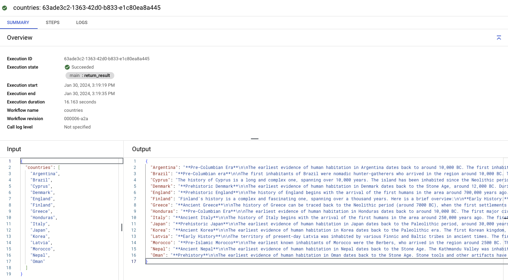

# Call VertexAI PaLM 2 for Text (text-bison) from Workflows in parallel

In this sample, you'll see how to call Vertex AI's PaLM 2 for Text (text-bison)
in parallel from Workflows. More specifically, you'll gather histories of
a list of countries in parallel and return the combined histories in a map.

## Before you start

Make sure you have the right IAM permissions for the default compute service
account that Workflows will use:

```sh
PROJECT_ID=genai-atamel
PROJECT_NUMBER=$(gcloud projects describe ${PROJECT_ID} --format "value(projectNumber)")

gcloud projects add-iam-policy-binding $PROJECT_ID \
    --member serviceAccount:$PROJECT_NUMBER-compute@developer.gserviceaccount.com \
    --role roles/aiplatform.user
```

## Single country

See [country-history.yaml](./country-history.yaml) or
[country-history-connector.yaml](./country-history-connector.yaml) for details.

Deploy:

```sh
gcloud workflows deploy country-history-text-bison --source=country-history.yaml
gcloud workflows deploy country-history-connector-text-bison --source=country-history-connector.yaml
```

Run:

```sh
gcloud workflows run country-history-text-bison --data='{"country":"Cyprus"}'
gcloud workflows run country-history-connector-text-bison --data='{"country":"Cyprus"}'


## Multiple countries in parallel

See [country-histories-connector.yaml](./country-histories-connector.yaml) for details.

Deploy:

```sh
gcloud workflows deploy country-histories-connector-text-bison --source=country-histories-connector.yaml
```

Run:

```sh
gcloud workflows run country-histories-connector-text-bison --data='{"countries":["Argentina", "Brazil", "Cyprus", "Denmark", "England","Finland", "Greece", "Honduras", "Italy", "Japan", "Korea","Latvia", "Morocco", "Nepal", "Oman"]}'
```

You should see an output similar to the following:


