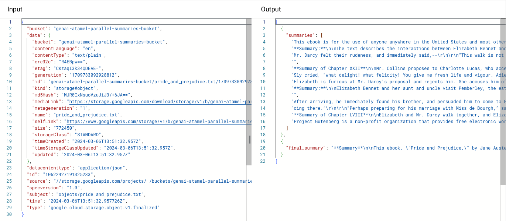

# Summarize a long document with Workflows and Gemini Pro

In this sample, you'll see how to take advantage of Workflows 
[parallel steps](https://cloud.google.com/workflows/docs/reference/syntax/parallel-steps) 
and Gemini Pro to create a summary of a long document received in a Google Cloud
Storage bucket.

Large-Language Models are very good at creating summaries, however they have a limited context window,
so they can't summarize documents that are longer than their context window.

A viable approach is to split a long document into smaller parts that fit the context window,
create a summary of each part, and then creating a final summary of all the parts summaries.

This pattern is following the _map/reduce_ pattern. The LangChain project
explains this
[map/reduce summarization](https://python.langchain.com/docs/use_cases/summarization#option-2.-map-reduce) 
technique in its documentation:


Thanks to Workflows parallel steps, it is possible to create the parts' summaries in parallel,
and then combine all the summaries with a final step to make the summary of summaries.

## Enable services

First, enable the required services:

```sh
gcloud services enable \
    aiplatform.googleapis.com \
    workflows.googleapis.com \
    workflowexecutions.googleapis.com \
    compute.googleapis.com \
    eventarc.googleapis.com \
    pubsub.googleapis.com
```

## Before you start

Make sure you have the right IAM permissions for the default compute service
account that Workflows will use:

```sh
PROJECT_ID=your-project-id
PROJECT_NUMBER=$(gcloud projects describe ${PROJECT_ID} --format "value(projectNumber)")

gcloud projects add-iam-policy-binding $PROJECT_ID \
    --member serviceAccount:$PROJECT_NUMBER-compute@developer.gserviceaccount.com \
    --role roles/aiplatform.user
```

## Deploy the workflow

See [parallel-summaries.yaml](./parallel-summaries.yaml) or
[parallel-summaries-connector.yaml](./parallel-summaries-connector.yaml) for
details.

Deploy:

```sh
gcloud workflows deploy parallel-summaries --source=parallel-summaries.yaml
gcloud workflows deploy parallel-summaries-connector --source=parallel-summaries-connector.yaml
```

## Create a Google Cloud Storage bucket and an Eventarc trigger

Follow the [steps from the
documentation](https://cloud.google.com/eventarc/docs/workflows/quickstart-storage)
to create an Eventarc trigger that executes a workflow when a new file is stored
in a Google Cloud Storage bucket.

Create the Google Cloud Stroage bucket:

```sh
gsutil mb -l us-central1 gs://${PROJECT_ID}-parallel-summaries-bucket/
```

Create the Eventarc trigger:

```sh
gcloud eventarc triggers create parallel-summaries-trigger \
    --destination-workflow=parallel-summaries \
    --location=us-central1 \
    --event-filters="type=google.cloud.storage.object.v1.finalized" \
    --event-filters="bucket=$PROJECT_ID-parallel-summaries-bucket" \
    --service-account="$PROJECT_NUMBER-compute@developer.gserviceaccount.com"
```

## Test

Upload a text file:

```sh
gsutil cp pride_and_prejudice_short.txt gs://${PROJECT_ID}-parallel-summaries-bucket/
```

Once you have uploaded a text file in the bucket, you should see a new workflow
execution and an output similar to the screenshot below, with the list of
chunks, the partial summaries, and the final summary:


