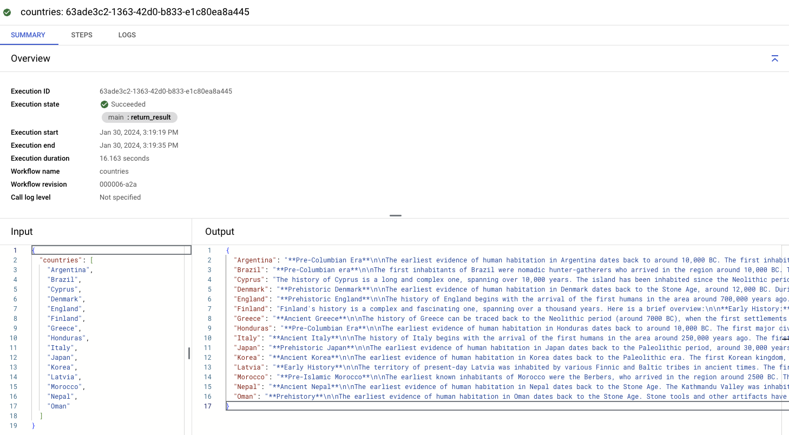

# Call VertexAI PaLM 2 for Text (text-bison) model from Workflows in parallel

## Before you start

Make sure you have the right IAM permissions for the default compute service
account that Workflows will use:

```sh
PROJECT_ID=genai-atamel
PROJECT_NUMBER=$(gcloud projects describe ${PROJECT_ID} --format "value(projectNumber)")

gcloud projects add-iam-policy-binding $PROJECT_ID \
    --member serviceAccount:$PROJECT_NUMBER-compute@developer.gserviceaccount.com \
    --role roles/aiplatform.user
```

## Display histories of countries

See [countries.yaml](./countries.yaml). This workflow shows how to display histories
of a list of countries by calling Vertex AI's PaLM 2 for Text (text-bison) model
in parallel for each country.

Deploy:

```sh
gcloud workflows deploy countries --source=countries.yaml
```

Run:

```sh
gcloud workflows run countries --data='{"countries":["Argentina", "Brazil", "Cyprus", "Denmark", "England","Finland", "Greece", "Honduras", "Italy", "Japan", "Korea","Latvia", "Morocco", "Nepal", "Oman"]}'
```

You should see an output similar to the following:

