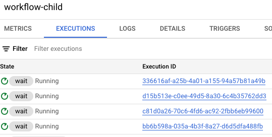

# A workflow executes other workflows in parallel

A workflow can execute other workflows. This can be useful in batch data
processing use cases where the parent workflow can divide the data in batches and
execute each batch in child workflows in parallel, wait for the results/failures
from each workflow execution and return an uber results/failures map in the end.
Since each batch is executed in a separate workflow execution, this makes it
easy to see if there's a failure.


Let's see how to set this up.

## Create and deploy a child workflow

First, let's create a child workflow in
[workflow-child.yaml](./workflow-child.yaml).

The child workflow receives some args from the parent workflow. In this case,
it's a simple `iteration` integer but in a real workflow, it'd be some data
chunk passed from the parent workflow:

```yaml
main:
  params: [args]
  steps:
    - init:
        assign:
          - iteration : ${args.iteration}
```

It does some work. In this case, it simply waits 10 seconds to simulate doing
some work:

```yaml
    - wait:
        call: sys.sleep
        args:
            seconds: 10
```

Returns the result or failure of the work. In this case, it just uses whether
the `iteration` is even or odd to simulate success and failure:

```yaml
    - check_iteration_even_or_odd:
        switch:
          - condition: ${iteration % 2 == 0}
            next: raise_error
    - return_message:
        return: ${"Hello world"+iteration}
    - raise_error:
        raise: ${"Error with iteration "+iteration}
```

Deploy the child workflow:

```sh
gcloud workflows deploy workflow-child --source=workflow-child.yaml
```

## Create and deploy a parent workflow

Let's create a parent workflow in
[workflow-parent.yaml](./workflow-parent.yaml).

The parent workflow first creates a map to store the results of successful and
failed execution results:

```yaml
main:
  steps:
    - init:
        assign:
          - execution_results: {} # results from each execution
          - execution_results.success: {} # successful executions saved under 'success' key
          - execution_results.failure: {} # failed executions saved under 'failure' key
```

It then starts a parallel for-loop to call the child workflow with data chunks.
In this case, it's simply passing integers 1 to 4 to simulate data. Parallel
works here as we assume each iteration is independent:

```yaml
    - execute_child_workflows:
        parallel:
          shared: [execution_results]
          for:
            value: iteration
            in: [1, 2, 3, 4]
            steps:
                - iterate:
```

In each iteration, the child workflow is executed with the `iteration` argument.
The parent workflow waits for the the success or failure of the child workflow
execution and captures the results/failures in the map:

```yaml
                    try:
                      steps:
                        - execute_child_workflow:
                            call: googleapis.workflowexecutions.v1.projects.locations.workflows.executions.run
                            args:
                              workflow_id: workflow-child
                              #location: ...
                              #project_id: ...
                              argument:
                                iteration: ${iteration}
                            result: execution_result
                        - save_successful_execution:
                            assign:
                              - execution_results.success[string(iteration)]: ${execution_result}
                    except:
                        as: e
                        steps:
                          - save_failed_execution:
                              assign:
                                - execution_results.failure[string(iteration)]: ${e}
```

In the final step, the results/failures map is returned:

```yaml
    - return_execution_results:
        return: ${execution_results}
```

Deploy the parent workflow:

```sh
gcloud workflows deploy workflow-parent --source=workflow-parent.yaml
```

## Execute the parent workflow

It's time to execute the parent workflow:

```sh
gcloud workflows run workflow-parent
```

As the parent workflow is running, you can see 4 parallel executions of the
child workflow:



Since they all run in parallel, after 10 seconds, you should see 2 of them
succeeded and 2 failed:


You can see the results of the successful executions in the parent workflow:


Also, see the errors of the failed executions:


At this point, you can decide to retry the failed executions or ignore them.
