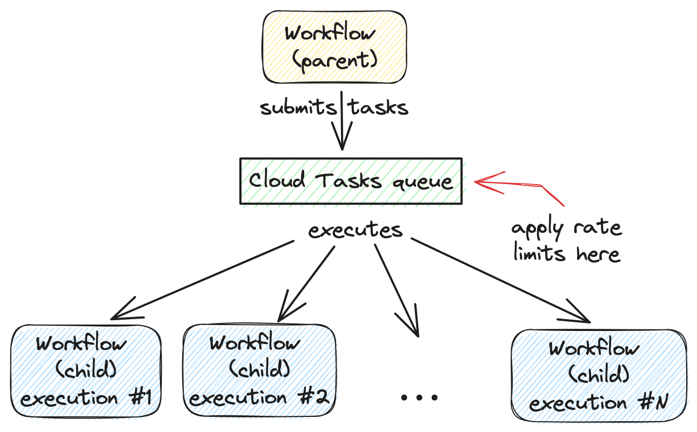

# Buffer workflow executions with a Cloud Tasks queue

When you receive a heavy burst of traffic, it's tempting to create a high number
of concurrent executions and let Workflows deal with them. This works until you hit
the [quotas](https://cloud.google.com/workflows/quotas) Workflows enforce. For
example, Workflows enforces **2000** maximum number of concurrent workflow
executions per region, per project. Once the limit is reached, new executions
fail with an HTTP 429.

Thankfully, a Cloud Tasks queue can help. Instead of creating Workflows
executions directly, you can add tasks to a Cloud Tasks queue and let Cloud
Tasks drain that queue at a rate you define. This way, you can better utilize
your workflow quota.

In this example, we show how a parent workflow can create tasks to execute a
child workflow at a specified rate using a Cloud Tasks queue in the middle.



## Create a Cloud Tasks queue

First, create a Cloud Tasks queue with no rate limits:

```sh
QUEUE=queue-workflow-child
LOCATION=us-central1

gcloud tasks queues create queue-workflow-child --location=$LOCATION
```

## Create and deploy a child workflow

Next, let's create a child workflow in [workflow-child.yaml](./workflow-child.yaml).

The child workflow receives an `iteration` argument from the parent workflow. It
waits 10 seconds to simulate doing work and returns a string as result:

```yaml
main:
  params: [args]
  steps:
    - init:
        assign:
          - iteration : ${args.iteration}
    - wait:
        call: sys.sleep
        args:
            seconds: 10
    - return_message:
        return: ${"Hello world"+iteration}
```

Deploy the child workflow:

```sh
gcloud workflows deploy workflow-child --source=workflow-child.yaml --location=$LOCATION
```

## Create and deploy a parent workflow

Next, create a parent workflow in [workflow-parent.yaml](./workflow-parent.yaml).

The workflow assigns some constants first. Note that it's referring to the child
workflow and the queue name between the parent and child workflows:

```yaml
main:
  steps:
    - init:
        assign:
          - project_id: ${sys.get_env("GOOGLE_CLOUD_PROJECT_ID")}
          - project_number: ${sys.get_env("GOOGLE_CLOUD_PROJECT_NUMBER")}
          - location: ${sys.get_env("GOOGLE_CLOUD_LOCATION")}
          - workflow_child_name: "workflow-child"
          - queue_name: "queue-workflow-child"
```

In the next step, it adds a high number of tasks to the Cloud Tasks queue to
execute the child workflow:

```yaml
    - enqueue_tasks_to_execute_child_workflow:
        for:
          value: iteration
          range: [1, 100]
          steps:
              - iterate:
                  assign:
                    - data:
                        iteration: ${iteration}
                    - exec:
                        # Need to wrap into argument for Workflows args.
                        argument: ${json.encode_to_string(data)}
              - create_task_to_execute_child_workflow:
                  call: googleapis.cloudtasks.v2.projects.locations.queues.tasks.create
                  args:
                      parent: ${"projects/" + project_id + "/locations/" + location + "/queues/" + queue_name}
                      body:
                        task:
                          httpRequest:
                            body: ${base64.encode(json.encode(exec))}
                            url: ${"https://workflowexecutions.googleapis.com/v1/projects/" + project_id + "/locations/" + location + "/workflows/" + workflow_child_name + "/executions"}
                            oauthToken:
                              serviceAccountEmail: ${project_number + "-compute@developer.gserviceaccount.com"}
```

Deploy the parent workflow:

```sh
gcloud workflows deploy workflow-parent --source=workflow-parent.yaml --location=$LOCATION
```

## Execute the parent workflow with no rate limits

Time to execute the parent workflow:

```sh
gcloud workflows run workflow-parent --location=$LOCATION
```

As the parent workflow is running, you can see parallel executions of the child
workflow, all executed roughly around the same:


In this case, 100 executions is a piece of cake for Workflows, but you can run
into quota issues, if you submit 1000s of executions all at once. This in when
Cloud Tasks queue and its rate limits become useful.

## Execute the parent workflow with rate limits

Let's now apply a rate limit to the Cloud Tasks queue. In this case, 1 dispatch
per second:

```sh
gcloud tasks queues update $QUEUE --max-dispatches-per-second=1 --location=$LOCATION
```

Execute the parent workflow again:

```sh
gcloud workflows run workflow-parent --location=$LOCATION
```

This time, you see a more smooth execution rate (1 execution request per second):


Playing with different dispatch rates and concurrency settings of Cloud Tasks
queues, you can better utilize your quota and stay below the limits without
triggering unnecessary quota related failures.

