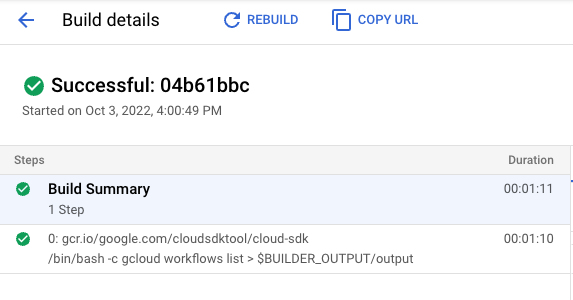
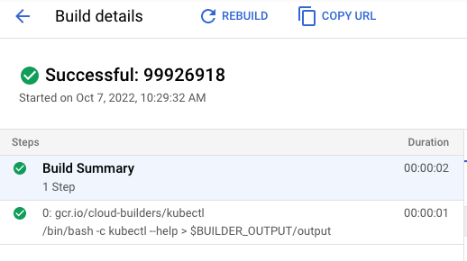

# Workflows executes commands (gcloud, kubectl) - using Cloud Build API

> **Note:** There's a [newer version](../using-standard-library/) of this sample
> that uses standard library for gcloud and kubectl instead of using Cloud Build
> API directly.

This example shows how to execute commands (such as gcluod, kubectl) from
Workflows via Cloud Build.

## Create a workflow for gcloud

Create a [workflow-gcloud.yaml](workflow-gcloud.yaml) with a `gcloud`
sub-workflow that executes a given `gcloud` command in a container based on
`gcr.io/google.com/cloudsdktool/cloud-sdk` in Cloud Build and returns the output
of the execution.

## Create a workflow for kubectl

Create a [workflow-kubectl.yaml](workflow-kubectl.yaml) with a `kubectl`
sub-workflow that executes a given `kubectl` command in a container based on
`gcr.io/cloud-builders/kubectl` in Cloud Build and returns the output
of the execution.

## Deploy the workflows

Make sure you have a Google Cloud project and the project id is set in `gcloud`:

```sh
PROJECT_ID=your-project-id
gcloud config set project $PROJECT_ID
```

Run [setup.sh](setup.sh) to enable required services, assign necessary roles and
deploy both workflows.

## Run the workflow for gcloud

Run the workflow from Google Cloud Console or `gcloud`:

```sh
gcloud workflows run workflow-gcloud
```

You should see a new build successfully running `gcloud` in Cloud Build:



You should also see the output of the `gcloud` command when the workflow
succeeds:

```log
result: '["NAME                                                                                        STATE   REVISION_ID  UPDATE_TIME",
"projects/atamel-workflows-gcloud/locations/us-central1/workflows/workflow-gcloud            ACTIVE  000001-7fa   2022-10-07T09:26:27.470230358Z",
"projects/atamel-workflows-gcloud/locations/us-central1/workflows/workflow-kubectl           ACTIVE  000001-215   2022-10-07T09:26:32.511757767Z",
""]'
```

## Run the workflow for kubectl

Run the workflow from Google Cloud Console or `gcloud`:

```sh
gcloud workflows run workflow-kubectl
```

You should see a new build successfully running `gcloud` in Cloud Build:



You should also see the output of the `kubectl` command when the workflow
succeeds:

```log
result: '["kubectl controls the Kubernetes cluster manager.",""," Find more information
  at: https://kubernetes.io/docs/reference/kubectl/overview/","","Basic Commands (Beginner):","  create        Create
  a resource from a file or from stdin","  expose        Take a replication controller,
  service, deployment or pod and expose it as a new Kubernetes service","  run           Run
  a particular image on the cluster","  set           Set specific features on objects","","Basic
  Commands (Intermediate):","  explain       Get documentation for a resource","  get           Display
  one or many resources","  edit          Edit a resource on the server","  delete        Delete
  resources by file names, stdin, resources and names, or by resources and label selector","","Deploy
  Commands:","  rollout       Manage the rollout of a resource","  scale         Set
  a new size for a deployment, replica set, or replication controller","  autoscale     Auto-scale
  a deployment, replica set, stateful set, or replication controller","","Cluster
  Management Commands:","  certificate   Modify certificate resources.","  cluster-info  Display
  cluster information","  top           Display resource (CPU/memory) usage","  cordon        Mark
  node as unschedulable","  uncordon      Mark node as schedulable","  drain         Drain
  node in preparation for maintenance","  taint         Update the taints on one or
  more nodes","","Troubleshooting and Debugging Commands:","  describe      Show details
  of a specific resource or group of resources","  logs          Print the logs for
  a container in a pod","  attach        Attach to a running container","  exec          Execute
  a command in a container","  port-forward  Forward one or more local ports to a
  pod","  proxy         Run a proxy to the Kubernetes API server","  cp            Copy
  files and directories to and from containers","  auth          Inspect authorization","  debug         Create
  debugging sessions for troubleshooting workloads and nodes","","Advanced Commands:","  diff          Diff
  the live version against a would-be applied version","  apply         Apply a configuration
  to a resource by file name or stdin","  patch         Update fields of a resource","  replace       Replace
  a resource by file name or stdin","  wait          Experimental: Wait for a specific
  condition on one or many resources","  kustomize     Build a kustomization target
  from a directory or URL.","","Settings Commands:","  label         Update the labels
  on a resource","  annotate      Update the annotations on a resource","  completion    Output
  shell completion code for the specified shell (bash or zsh)","","Other Commands:","  api-resources
  Print the supported API resources on the server","  api-versions  Print the supported
  API versions on the server, in the form of \"group/version\"","  config        Modify
  kubeconfig files","  plugin        Provides utilities for interacting with plugins","  version       Print
  the client and server version information","","Usage:","  kubectl [flags] [options]","","Use
  \"kubectl \u003ccommand\u003e --help\" for more information about a given command.","Use
  \"kubectl options\" for a list of global command-line options (applies to all commands).",""]'
```
