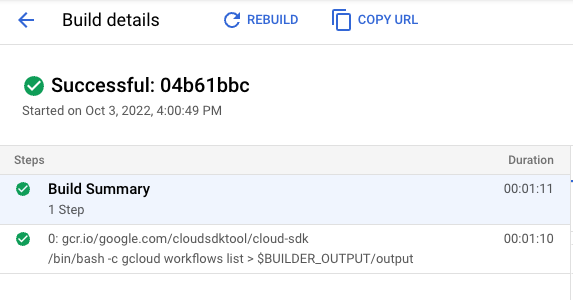

# Workflows executes gcloud commands

This example shows how to execute gcloud commands from Workflows via Cloud
Build.

## Create a workflow

Create a [workflow.yaml](workflow.yaml) with a `gcloud` sub-workflow that
executes a given `gcloud` command using Cloud Build and returns the output of
`gcloud` command.

## Deploy the workflow

Make sure you have a Google Cloud project and the project id is set in `gcloud`:

```sh
PROJECT_ID=your-project-id
gcloud config set project $PROJECT_ID
```

Run [setup.sh](setup.sh) to enable required services, assign necessary roles and
deploy the workflow defined in [workflow.yaml](workflow.yaml).

## Run the workflow

Run the workflow from Google Cloud Console or `gcloud`:

```sh
gcloud workflows run workflows-executes-gcloud
```

You should see a new build successfully running `gcloud` in Cloud Build:



You should also see the output of the `gcloud` command when the workflow
succeeds:

```log
result:
'["NAME                                                                                        STATE   REVISION_ID  UPDATE_TIME",
  "projects/atamel-workflows-gcloud/locations/us-central1/workflows/workflows-executes-gcloud  ACTIVE  000021-e33   2022-10-03T14:59:56.375932228Z",
""]'
```
