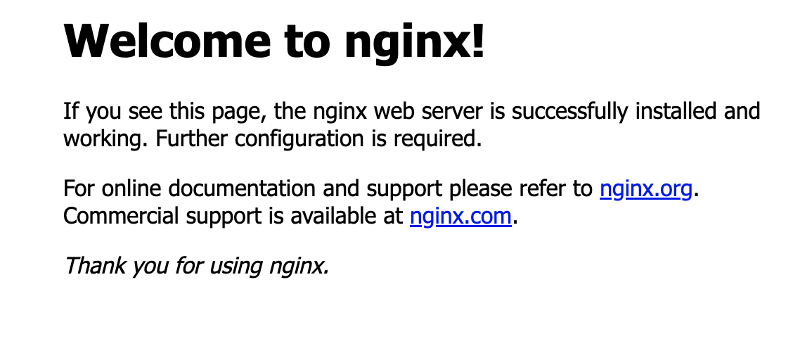

# Deploy a Kubernetes application with Workflows

This workflow demonstrates how to deploy a Kubernetes application with
Workflows. More specifically:

1. Create a GKE cluster with Kubernetes Engine API connector.
1. Create a Kubernetes deployment with the Kubernetes API connector.
1. Create a Kubernetes service with the Kubernetes API connector.

## Create a GKE cluster with Kubernetes Engine API connector

You can use [Kubernetes Engine
API](https://cloud.google.com/kubernetes-engine/docs/reference/rest) to create
and manage GKE clusters and Workflows has a [Kubernetes Engine API
connector](https://cloud.google.com/workflows/docs/reference/googleapis/container/Overview)
use that API.

This is how you can create an auto-pilot enabled GKE cluster with Workflows:

```yaml
main:
  steps:
    - init:
        assign:
          - project_id: ${sys.get_env("GOOGLE_CLOUD_PROJECT_ID")}
          - cluster_location: "us-central1"
          - cluster_id: "workflows-cluster"
          - cluster_full_name: ${"projects/" + project_id + "/locations/" + cluster_location + "/clusters/" + cluster_id}
    - create_k8s_cluster:
        call: googleapis.container.v1.projects.locations.clusters.create
        args:
          body:
            cluster:
              name: ${cluster_id}
              initial_node_count: 1
              autopilot:
                enabled: true
          parent: ${"projects/" + project_id + "/locations/" + cluster_location}
```

You can also optionally make sure the GKE cluster is created and running before
proceeding:

```yaml
    - assert_running:
        call: assert_cluster_status
        args:
          expected_status: "RUNNING"
          cluster_id: ${cluster_id}
          cluster_full_name: ${cluster_full_name}

assert_cluster_status:
  params:
    [expected_status, cluster_id, cluster_full_name]
  steps:
    - get_cluster:
        call: googleapis.container.v1.projects.locations.clusters.get
        args:
          clusterId: ${cluster_id}
          name: ${cluster_full_name}
        result: cluster
    - compare:
        switch:
          - condition: ${cluster.status == expected_status}
            next: end
    - fail:
        raise: ${"Expected VM status is " + expected_status + ". Got " + cluster.status + " instead."}
```

## Create a Kubernetes deployment with the Kubernetes API connector

You can use [Kubernetes
API](https://kubernetes.io/docs/reference/generated/kubernetes-api/v1.27/) to
read and write Kubernetes resources such as deployments and services and
Workflows has a [Kubernetes API
connector](https://cloud.google.com/workflows/docs/reference/connectors/gke/Overview)
use that API.

Here's an example of creating a Kubernetes deployment with 3 NGINX pods from the
Kubernetes [documentation](https://kubernetes.io/docs/concepts/workloads/controllers/deployment/):

```yaml
    - create_deployment:
        call: gke.request
        args:
          project: ${sys.get_env("GOOGLE_CLOUD_PROJECT_ID")}
          cluster_id: ${cluster_id}
          location: ${cluster_location}
          method: "POST"
          path: "/apis/apps/v1/namespaces/default/deployments"
          body:
            kind: Deployment
            metadata:
              name: nginx-deployment
              labels:
                app: nginx
            spec:
              replicas: 3
              selector:
                matchLabels:
                  app: nginx
              template:
                metadata:
                  labels:
                    app: nginx
                spec:
                  containers:
                  - name: nginx
                    image: nginx:1.14.2
                    ports:
                    - containerPort: 80
        result: create_deployment_result
```

## Create a Kubernetes service with the Kubernetes API connector

Next, you can create a Kubernetes Service to expose the deployment to the
outside world:

```yaml
    - create_service:
        call: gke.request
        args:
          project: ${sys.get_env("GOOGLE_CLOUD_PROJECT_ID")}
          cluster_id: ${cluster_id}
          location: ${cluster_location}
          method: "POST"
          path: "/api/v1/namespaces/default/services"
          body:
            kind: Service
            apiVersion: v1
            metadata:
              name: nginx-service
            spec:
              ports:
              - name: http
                port: 80
                targetPort: 80
              selector:
                app: nginx
              type: LoadBalancer
        result: create_service_result
```

## Deploy and run the workflow

You can see the full [workflow.yaml](./workflow.yaml).

Deploy the workflow:

```sh
gcloud workflows deploy workflows-kubernetes-engine --source=workflow.yaml
```

Run the workflow:

```sh
gcloud workflows run workflows-kubernetes-engine
```

As the workflow is running, you should see the GKE cluster is being created:


Once the cluster is running, authenticate for `kubectl`:

```sh
gcloud container clusters get-credentials workflows-cluster --region us-central1 --project [your-project-id]
```

Now, you should be able to see the running pods:

```sh
kubectl get pods

NAME                                READY   STATUS
nginx-deployment-74858db79d-b27nk   1/1     Running
nginx-deployment-74858db79d-jkttq   1/1     Running
nginx-deployment-74858db79d-pp5md   1/1     Running
```

See the service:

```sh
kubectl get svc

NAME            TYPE           CLUSTER-IP      EXTERNAL-IP
kubernetes      ClusterIP      34.118.224.1    <none>
nginx-service   LoadBalancer   34.118.238.91   34.28.175.199
```

And, if you go to the external IP, you should see the NGINX landing page, which
means our pods are running and the service is public:

