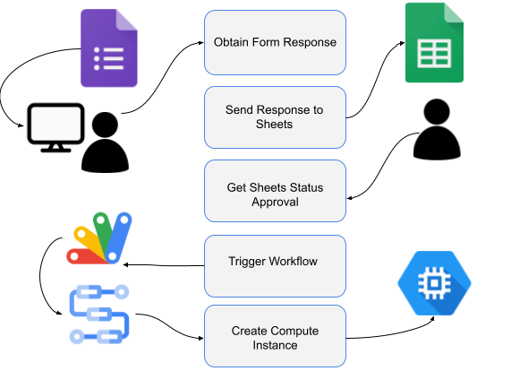
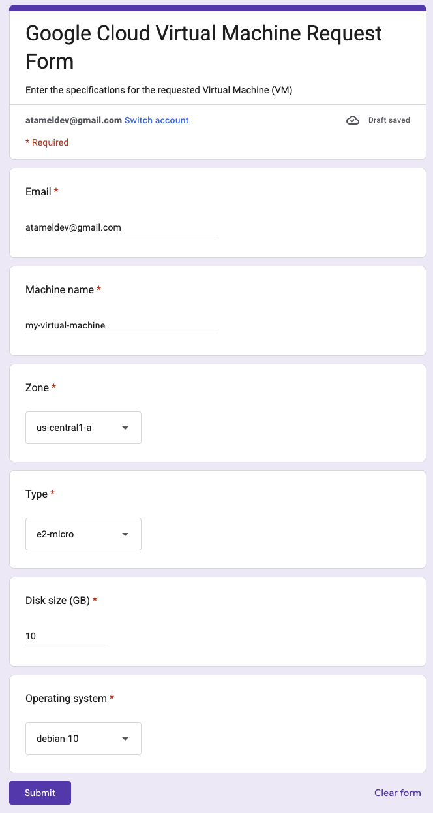
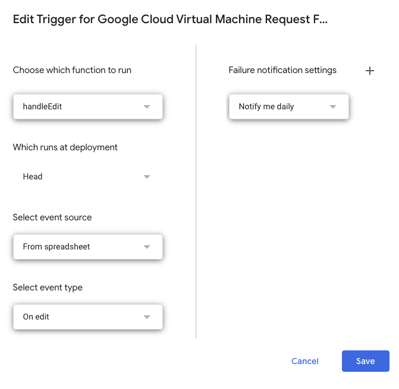
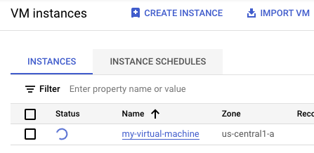

# Google Workspace and Workflows integration

In this sample, we show you how to use [Google
Workspace](https://workspace.google.com/) as a frontend for Workflows.

More specifically:

1. A Google Form captures the Virtual Machine (VM) creation requests.
1. A Google Sheet saves the responses from the Google Form with an
   approved checkbox.
1. When the approved checkbox is enabled by a human, an App Script calls a
   workflow with the supplied VM parameters from the form.
1. The workflow calls the Compute Engine API to create the VM for the user.



## Create a Google Form

Create a Google Form to capture the VM creation request from users.

Go to [Google Forms](https://docs.google.com/forms) page and create a new form
similar to the
[following](https://docs.google.com/forms/d/e/1FAIpQLSercSIn9KxVwCCADAC3vI6zNMBI42Zh7Nzba1_K6m24P_opqA/viewform?usp=sf_link):



Make sure you have `Collect email addresses` option checked under settings.
We'll need an email address while creating a VM later.

## Create a Google Sheet

Create a Google Sheet to capture the responses from the form. Under the
`Responses` tab, click on the `Create Spreadsheet` button.

This takes you to the spreadsheet with the responses. In this spreadsheet, add
an `Approved` column with a checkbox:


This checkbox will be used to trigger a workflow to create the VM.

## Create an Apps Script

Create an Apps Script to watch for the `Approved` checkbox.

Go to `Extensions` and `Apps Script` in the spreadsheet. This opens up the App
Script editor. Replace the default code in `Code.gs` with the code in
[Code.gs](Code.gs). Make sure you replace the `PROJECT_ID` with your own project
id. This code watches for changes for the checkbox in the approved column. When
it's checked, calls a workflow to create the VM.

In App Script editor, go to `Settings` and check `Show appsscript.json manifest
file in editor`. Replace the contents of `appscript.json` with
[appscript.json](appscript.json). This makes sure that the App Script has the
required permissions.

Go to `Triggers` section and create a trigger from the sheet to the App
Script when the sheet is edited:



## Create a workflow

Make sure you have a Google Cloud project and the project id is set in `gcloud`:

```sh
PROJECT_ID=your-project-id
gcloud config set project $PROJECT_ID
```

Run [setup.sh](setup.sh) to enable required services, grant necessary roles and
deploy the workflow defined in [workflow.yaml](workflow.yaml). This workflow
creates a Compute Engine VM with the supplied parameters.

## Test

You're now ready to test the end-to-end flow.

Go back to the sheet and check the `Approved?` checkbox for the entry you had
from before:


In App Script console, you can see a new execution:


In Workflows console, you can see a new execution:


And finally, in Compute Engine console, you can see that a new VM is being
created:


