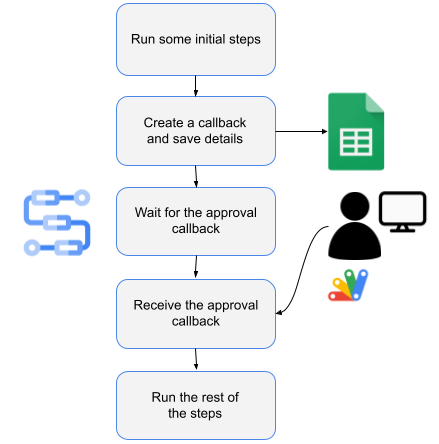
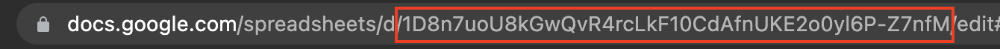

# Workflows that pause and wait for human approvals from Google Sheets

In this sample, we show you how to have a workflow wait for human approval from
Google Sheets.

More specifically:

1. A workflow runs some initial steps.
2. The workflow creates a callback, saves the callback info to a Google Sheets
   spreadsheet, and starts to wait for an approval from a human for the rest of
   the steps.
3. A human sends his/her approval via the Google Sheets spreadsheet.
4. The workflow receives the approval and runs the rest of the steps.



## Create a Google Sheet

First, create a Google Sheet spreadsheet to capture callback approval requests.
The spreadsheet can contain any info you deem necessary for the approval
request.

Here's an example spreadsheet:


The `Approved` column will be used to initiate a callback to the workflow.

Once the sheet is created, note the spreadsheet id that you will need in the workflow
later. You can find the sheet id in the url of the spreadsheet:



Later, you will deploy the workflow with the default compute service account for
simplicity. Find this service account email address by visiting `IAM & Admin` ->
`Service Accounts` section of Google Cloud Console:


Make sure this service account has write permissions to the spreadsheet:


## Create an Apps Script

Create an Apps Script to watch for the `Approved` column.

Go to `Extensions` and `Apps Script` in the spreadsheet. This opens up the App
Script editor. Replace the default code in `Code.gs` with the code in
[Code.gs](Code.gs) and press the `Save` button.

This code watches for changes for the `Approved` column. When
it's set to `TRUE`, calls back workflow's callback URL with the approver
information.

In App Script editor, go to `Settings` and check `Show appsscript.json manifest
file in editor`. Replace the contents of `appscript.json` with
[appscript.json](appscript.json). This makes sure that the App Script has the
required permissions.

Go to `Triggers` section and create a trigger from the sheet to the App
Script when the sheet is edited:


## Create a workflow

Create a [workflow.yaml](workflow.yaml) to run some initial steps, wait for the
sheets callback and once received, run some more steps. Make sure you replace
sheet id:

```yaml
main:
  steps:
    - init:
        assign:
        # Replace with your sheetId and make sure the service account
        # for the workflow has write permissions to the sheet
        - sheetId: "10hieAH6b-oMeIVT_AerSLNxQck14IGhgi8ign-x2x8g"
    - before_sheets_callback:
        call: sys.log
        args:
          severity: INFO
          data: ${"Execute steps here before waiting for callback from sheets"}
    - wait_for_sheets_callback:
        call: await_callback_sheets
        args:
          sheetId: ${sheetId}
        result: await_callback_result
    - after_sheets_callback:
        call: sys.log
        args:
          severity: INFO
          data: ${"Execute steps here after receiving callback from sheets"}
    - returnResult:
        return: ${await_callback_result}
```

The `await_callback_sheets` sub-workflow receives a sheet id, creates a callback,
saves the callback into to Google Sheets and waits for the callback:

```yaml
await_callback_sheets:
    params: [sheetId]
    steps:
        - init:
            assign:
              - project_id: ${sys.get_env("GOOGLE_CLOUD_PROJECT_ID")}
              - location: ${sys.get_env("GOOGLE_CLOUD_LOCATION")}
              - workflow_id: ${sys.get_env("GOOGLE_CLOUD_WORKFLOW_ID")}
              - execution_id: ${sys.get_env("GOOGLE_CLOUD_WORKFLOW_EXECUTION_ID")}
        - create_callback:
            call: events.create_callback_endpoint
            args:
              http_callback_method: POST
            result: callback_details
        - save_callback_to_sheets:
            call: googleapis.sheets.v4.spreadsheets.values.append
            args:
                range: ${"Sheet1!A1:G1"}
                spreadsheetId: ${sheetId}
                valueInputOption: RAW
                body:
                    majorDimension: "ROWS"
                    values:
                      - ["${project_id}", "${location}", "${workflow_id}", "${execution_id}", "${callback_details.url}", "", "FALSE"]
        - log_and_await_callback:
            try:
              steps:
                - log_await_start:
                    call: sys.log
                    args:
                      severity: INFO
                      data: ${"Started waiting for callback from sheet " + sheetId}
                - await_callback:
                    call: events.await_callback
                    args:
                      callback: ${callback_details}
                      timeout: 3600
                    result: callback_request
                - log_await_stop:
                    call: sys.log
                    args:
                      severity: INFO
                      data: ${"Stopped waiting for callback from sheet " + sheetId}
            except:
                as: e
                steps:
                    - log_error:
                        call: sys.log
                        args:
                            severity: "ERROR"
                            text: ${"Received error " + e.message}
        - check_null_await_result:
            switch:
              - condition: ${callback_request == null}
                return: null
        - log_await_result:
            call: sys.log
            args:
              severity: INFO
              data: ${"Approved by " + callback_request.http_request.body.approver}
        - return_await_result:
            return: ${callback_request.http_request.body}
```

## Deploy the workflow

Make sure you have a Google Cloud project and the project id is set in `gcloud`:

```sh
PROJECT_ID=your-project-id
gcloud config set project $PROJECT_ID
```

Run [setup.sh](setup.sh) to enable required services, grant necessary roles and
deploy the workflow defined in [workflow.yaml](workflow.yaml).

## Run the workflow

You're now ready to test the end-to-end flow.

Run the workflow from Google Cloud Console or `gcloud`:

```sh
gcloud workflows run workflows-awaits-callback-sheets
```

You should see the workflow is in waiting state:


The logs also tell us that the workflow is waiting:

```log
Info
2022-09-27 09:58:00.892 BST Execute steps here before waiting for callback from sheets
Info
2022-09-27 09:58:01.887 BST Started waiting for callback from sheet 10hieAH6b-oMeIVT_AerSLNxQck14IGhgi8ign-x2x8g
```

Go back to the sheet and you should also see the callback info appended by
workflows with `Approved` column set to `FALSE`:


Now, add an approver name/email and change `Approved` colum to `TRUE`:


You should see the workflow is now succeeded:


The logs also tell us that the workflow is approved and completed:

```log
Info
2022-09-27 10:04:11.101 BST Approved by Mete Atamel
Info
2022-09-27 10:04:11.442 BST Execute steps here after receiving callback from sheets
```
