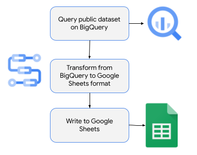
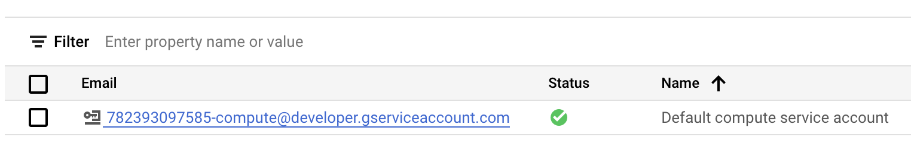
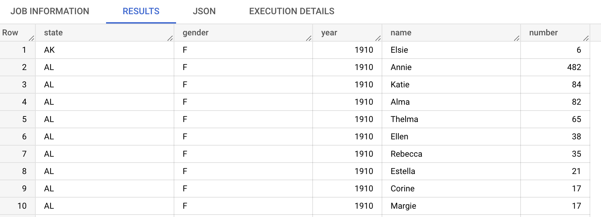
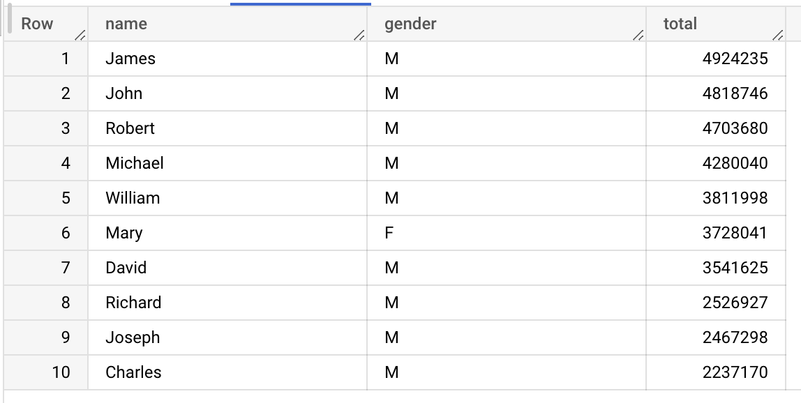
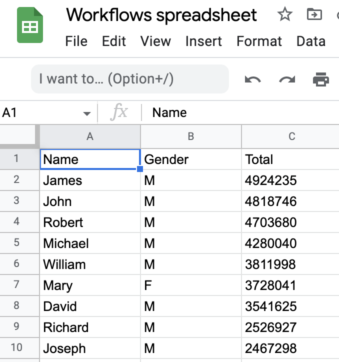

# Writing to Google Sheets from Workflows

This samples shows how a workflow can query top names from a public dataset in
BigQuery and writes the results to a Google Sheets spreadsheet.



## Create a spreadsheet in Google Sheets

First, create a spreadsheet in Google Sheets that the workflow will write results to.

Once the sheet is created, note the spreadsheet id that you will need in the workflow
later. You can find the sheet id in the url of the spreadsheet:


Later, you will deploy the workflow with the default compute service account for
simplicity. Find this service account email address by visiting `IAM & Admin` ->
`Service Accounts` section of Google Cloud Console:



Make sure this service account has write permissions to the spreadsheet:


## Explore the public BigQuery dataset

You will use the `usa_names.usa_1910_2013` public BigQuery dataset that contains
people names and other information.

You can see the first 100 rows with this query:

```sql
SELECT *
FROM `bigquery-public-data.usa_names.usa_1910_2013`
LIMIT 100
```



You can find 100 most popular names with this query:

```sql
SELECT name, gender, SUM(number) AS total
FROM `bigquery-public-data.usa_names.usa_1910_2013`
GROUP BY name, gender
ORDER BY total DESC
LIMIT 100
```



This is the query you will use in the workflow.

## Create a workflow

Create a [workflow.yaml](workflow.yaml) to find most popular names from the
BigQuery public dataset and write to the spreadsheet in Google Sheets.

First, define your sheet id and limit:

```yaml
main:
    steps:
    - init:
        assign:
        # Replace with your sheetId and make sure the service account
        # for the workflow has write permissions to the sheet
        - sheetId: "1D8n7uoU8kGwQvR4rcLkF10CdAfnUKE2o0yl6P-Z7nfM"
        - limit: 100
```

Run the query against the BigQuery public dataset:

```yaml
    - runQuery:
        call: googleapis.bigquery.v2.jobs.query
        args:
            projectId: ${sys.get_env("GOOGLE_CLOUD_PROJECT_ID")}
            body:
                useLegacySql: false
                # Query name and gender of most popular names
                query: ${"SELECT name, gender, SUM(number) AS total
                    FROM `bigquery-public-data.usa_names.usa_1910_2013`
                    GROUP BY name, gender
                    ORDER BY total DESC
                    LIMIT " + limit}
        result: queryResult
```

Initialize a rows list, parse the query results and insert each row into the
rows list:

```yaml
    - init_header_row:
        assign:
        - rows:
            - ["Name", "Gender", "Total"]
    - process_query_result:
        for:
            value: row
            in: ${queryResult.rows}
            steps:
            - process_each_row:
                assign:
                - name: ${row.f[0].v}
                - gender: ${row.f[1].v}
                - total: ${row.f[2].v}
                - row: ["${name}", "${gender}", "${total}"]
                - rows: ${list.concat(rows, row)}
```

Finally, clear any existing values in the spreadsheet and insert the rows:

```yaml
    - clear_existing_values:
        call: googleapis.sheets.v4.spreadsheets.values.clear
        args:
            range: "Sheet1"
            spreadsheetId: ${sheetId}
        result: clearResult
    - update_sheet:
        call: googleapis.sheets.v4.spreadsheets.values.update
        args:
            range: ${"Sheet1!A1:C" + (limit + 1)}
            spreadsheetId: ${sheetId}
            valueInputOption: RAW
            body:
                majorDimension: "ROWS"
                values: ${rows}
        result: updateResult
    - returnResult:
        return: ${updateResult}
```

## Deploy the workflow

Make sure you have a Google Cloud project and the project id is set in `gcloud`:

```sh
PROJECT_ID=your-project-id
gcloud config set project $PROJECT_ID
```

Run [setup.sh](setup.sh) to enable required services, and deploy the workflow
defined in [workflow.yaml](workflow.yaml) with the default compute service account.

## Run the workflow

You're now ready to test the workflow.

Run the workflow from Google Cloud Console or `gcloud`:

```sh
gcloud workflows run read-bigquery-write-sheets
```

In a few seconds, you should see the workflow execution finished and the
spreadsheet has the rows extracted from the BigQuery dataset:


